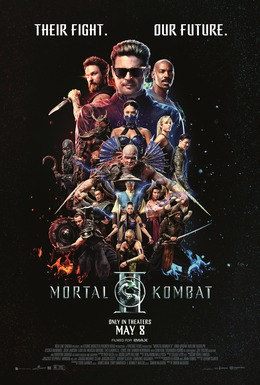

> Sequência de Mortal Kombat (2021), dirigida por Simon McQuoid e escrita por Jeremy Slater, baseada na franquia de jogos de Ed Boon e John Tobias. Karl Urban estreia como Johnny Cage, ator de filmes de artes marciais recrutado por Raiden e Sonya Blade para lutar ao lado dos campeões do Plano Terreno num torneio interdimensional contra o imperador Shao Kahn. Hiroyuki Sanada, Joe Taslim, Ludi Lin, Mehcad Brooks, Jessica McNamee e Lewis Tan reprisam papéis do primeiro filme; Adeline Rudolph entra como a princesa Kitana. Estreou nos cinemas dos EUA em 8 de maio de 2026 e no Brasil em 7 de maio. 116 minutos.

Vi por indicação da Laurien em 19 de junho. Um dos filmes mais galhofas que eu já vi. É tão ruim que dá a volta e fica divertido. Acabou me inspirando a criar a escala Morbius de filme indicado pela Laurien.

