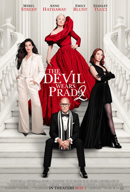

> Sequência de _O Diabo Veste Prada_ (2006), dirigida por David Frankel. Vinte anos após deixar o posto de assistente na Runway, a jornalista Andy Sachs é demitida da própria redação e acaba contratada como editora da revista pela proprietária — à revelia de Miranda Priestly. Meryl Streep, Anne Hathaway, Emily Blunt e Stanley Tucci retornam aos papéis originais.

Filme bem interessante, talvez por eu estar esperando muito pouco. Acho covarde em várias críticas: apenas levanta o tema e não volta para resolvê-lo. Ao final, as soluções são meio que dadas, como se não houvesse nada que pudesse ser feito; bilionários são forças da natureza, apenas devemos saber as pessoas certas com quem falar.

