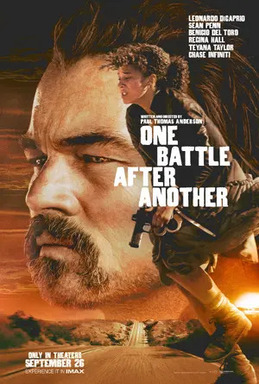

> Action-thriller dirigido, escrito e produzido por Paul Thomas Anderson, inspirado no romance Vineland de Thomas Pynchon (1990). Leonardo DiCaprio faz Bob Ferguson, ex-revolucionário forçado a voltar à ação dezesseis anos depois, quando o coronel Steven J. Lockjaw (Sean Penn) reaparece. Benicio del Toro, Regina Hall, Teyana Taylor e Chase Infiniti completam o elenco. 162 minutos. Levou Melhor Filme e Melhor Direção no Critics' Choice Awards 2026.

Um dos filmes mais divertidos do ano. DiCaprio, Sean Penn e Benicio del Toro estão muito bem. Uma parte ruim é retratar rebeldes e o estado como paridade de armas e objetificação total da personagem feminina, mas as partes boas e a direção compensam isso completamente.

