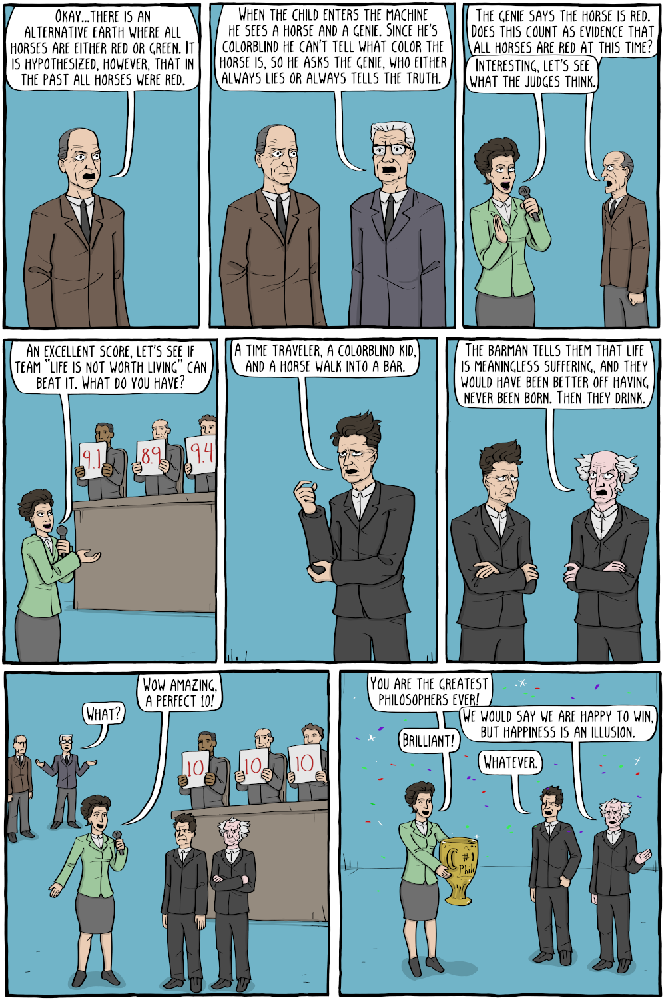

Tirinha de Corey Mohr (Existential Comics).

![Página 1: apresentadora de blazer verde com microfone: “Welcome to The Philosophers Challenge, where two teams of philosophers compete to come up with a brilliant thought experiment based on our mystery ingredients.” / “Our finalists are team "Inductive Investigations", with Nelson Goodman and Carl Gustav Hempel.” / “And team "Life is Not Worth Living", with Emil Cioran and Arthur Schopenhauer.” / “Okay philosophers, you must construct a philosophical thought experiment with the following items: a time travel machine, a color blind child, an alternate Earth with one minor difference, and...a horse.” / “Okay, what if....the child encounters a time traveler who claims to have swapped all red colors with green, how would he know?” / “But how are we going to use the horse?” / “What if on the alternate Earth, horses can time travel, but only brown...horses?” / “No, the child goes back to cure his color blindness, but discovers that on twin Earth, everyone is colorblind except for horses.” / “Okay, that's it, time is up. Philosophers, present your thought experiments.” Página 2: “Okay...there is an alternative Earth where all horses are either red or green. It is hypothesized, however, that in the past all horses were red.” / “When the child enters the machine he sees a horse and a genie. Since he's colorblind he can't tell what color the horse is, so he asks the genie, who either always lies or always tells the truth.” / “The genie says the horse is red. Does this count as evidence that all horses are red at this time?” / “Interesting, let's see what the judges think.” Jurados mostram placas “9.1”, “8.9”, “9.4”. / “An excellent score, let's see if team "Life is Not Worth Living" can beat it. What do you have?” / “A time traveler, a colorblind kid, and a horse walk into a bar.” / “The barman tells them that life is meaningless suffering, and they would have been better off having never been born. Then they drink.” / “What?” / “Wow amazing, a perfect 10!” (placas “10”, “10”, “10”) / “You are the greatest philosophers ever!” / “Brilliant!” / “We would say we are happy to win, but happiness is an illusion.” / “Whatever.” Troféu com “#1 Phil”.](philosopher-s-challenge-1.png)

