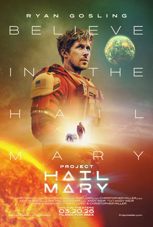

> Ficção científica dirigida por Phil Lord e Christopher Miller, escrita por Drew Goddard a partir do romance de Andy Weir (2021). Ryan Gosling faz Ryland Grace, professor de ciências que acorda em uma nave interestelar sem memória de como chegou lá. Sandra Hüller, James Ortiz e Lionel Boyce no elenco. Estreou em Londres em março de 2026. 156 minutos.

Um dos melhores filmes de ficção científica dos últimos anos.

