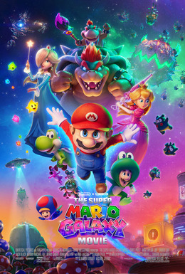

> Animação dirigida por Aaron Horvath e Michael Jelenic, sequência de The Super Mario Bros. Movie (2023). Chris Pratt e Charlie Day reprisam Mario e Luigi; Jack Black volta como Bowser; Glen Powell entra como Fox McCloud; Brie Larson como Princesa Rosalina. A aventura sai do Reino dos Cogumelos rumo ao espaço. Estreou em Kyoto em março de 2026; cinemas EUA em abril. 98 minutos.

Filme que parece uma colagem de curtas de TikTok da Nintendo. Destaque para o Bowser (Jack Black) e Fox McCloud.

