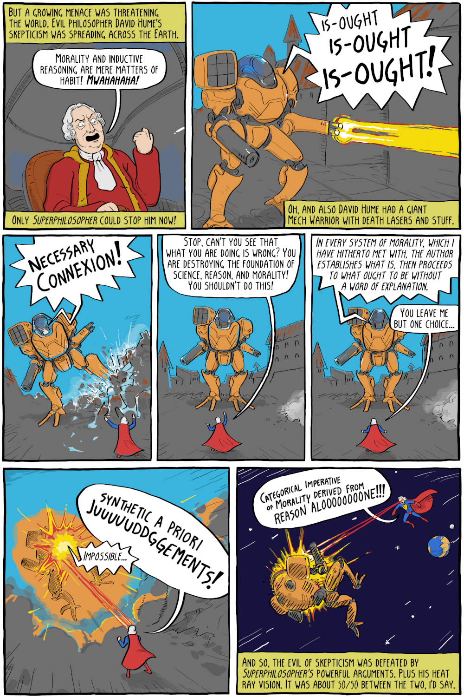

Comic by Corey Mohr (Existential Comics).

![Page 1 (captions): “In the endless reaches of the universe, there once existed a planet known as Minerva, a planet that burned like a green star in the distant heavens.” / “There, civilization was far advanced and it brought forth a race of "superphilosophers," whose mental powers were developed to the absolute peak of human perfection.” / “What is the best animal?” / “Raccoon.” / “Correct.” / “But there came a day when giant quakes threatened to destroy Minerva forever. One of the planet's leading philosophers, sensing the approach of doom, placed his infant son in a small rocket ship and sent it hurtling in the direction of the Earth just as Minerva exploded.” / “The rocketship sped through space, landing on Earth in the small German town of Königsberg with its precious burden: Minerva's sole survivor. A passing coachman found the uninjured child and took it to an orphanage.” / “As the years went by and the child grew to maturity, he found himself possessed of amazing philosophical powers.” / “This argument is totally stupid.” (book “Spinoza”) / “He was wiser than a scientist, more smart than a mathematician, he could leap faulty arguments in single logical bound.” / “This argument is even stupider than the last one.” (book “Berkeley”) / “By day he disguised himself as mild-mannered philosopher Immanuel Kant, but when duty called, he became the somewhat less mildly mannered...Superphilosopher!” Page 2: “But a growing menace was threatening the world. Evil philosopher David Hume's skepticism was spreading across the Earth.” / “Morality and inductive reasoning are mere matters of habit! Mwahahaha!” / “Only Superphilosopher could stop him now!” / “Is-ought is-ought is-ought!” / “Oh, and also David Hume had a giant Mech Warrior with death lasers and stuff.” / “Necessary connexion!” / “Stop, can't you see that what you are doing is wrong? You are destroying the foundation of science, reason, and morality! You shouldn't do this!” / “In every system of morality, which I have hitherto met with, the author establishes what is, then proceeds to what ought to be without a word of explanation.” / “You leave me but one choice...” / “Synthetic a priori juuuuddggements!” / “Impossible...” / “Categorical imperative of morality derived from reason aloooooooone!!!” / “And so, the evil of skepticism was defeated by Superphilosopher's powerful arguments. Plus his heat ray vision. It was about 50/50 between the two, I'd say.”](superphilosopher-1.png)

