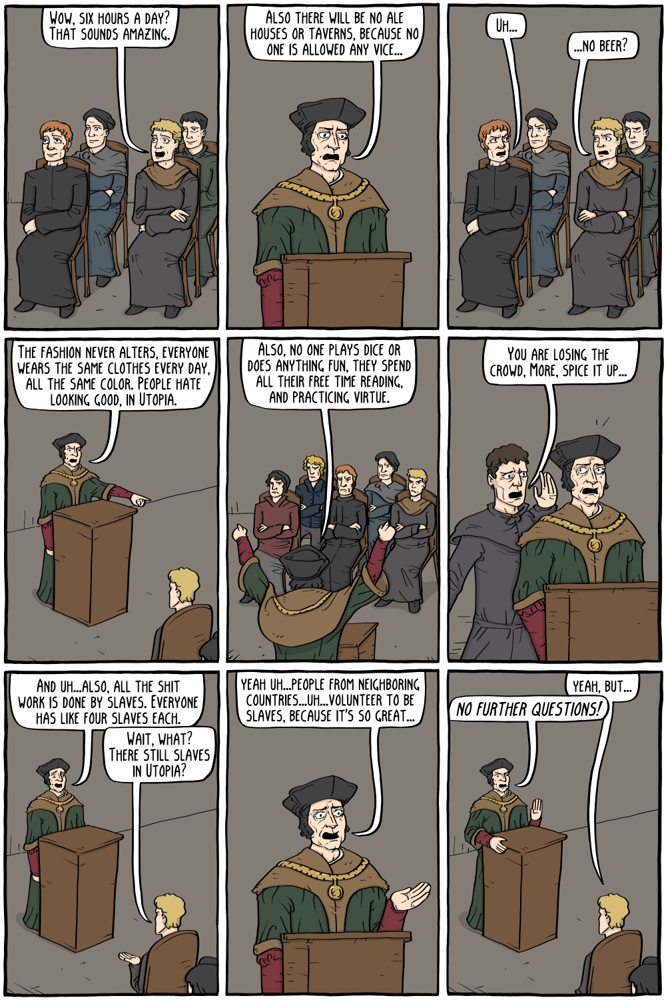

Comic by Corey Mohr (Existential Comics).

![Page 1: a speaker at a lectern: “We should be more like the land of Utopia. In Utopia, they don't execute thieves, nor imprison them. They are still free in their lives, but they simply must work for the public good to repay their debt.” / “In Utopia, they don't spend endless tax dollars on engaging in conquest of other lands to increase the glory of their Prince, they spend the money to improve their own country.” / crowd: “That sounds pretty good.” / “Yeah...” / “The government is chosen by the people based on merit, and governs in the interest of the people, not to enrich themselves.” / “That would be a lot better than our oppressive king.” / “No one will be able to hoard property, in Utopia, while others starve. Property itself is abolished and everyone takes what they need, as enough is produced for all to share.” / “They only have to work six hours a day, because the great idle classes in our society, the priests, nobleman, and wealthy, don't exist. Not only that, but everyone who labors on the luxuries of the rich can work instead for the benefit of society as a whole.” Page 2: “Wow, six hours a day? That sounds amazing.” / “Also there will be no ale houses or taverns, because no one is allowed any vice...” / “Uh...” / “...no beer?” / “The fashion never alters, everyone wears the same clothes every day, all the same color. People hate looking good, in Utopia.” / “Also, no one plays dice or does anything fun, they spend all their free time reading, and practicing virtue.” / assistant: “You are losing the crowd, More, spice it up...” / “And uh...also, all the shit work is done by slaves. Everyone has like four slaves each.” / “Wait, what? There still slaves in Utopia?” / “Yeah uh...people from neighboring countries...uh...volunteer to be slaves, because it's so great...” / “Yeah, but...” / “No further questions!”](thomas-more-s-utopia-1.png)

