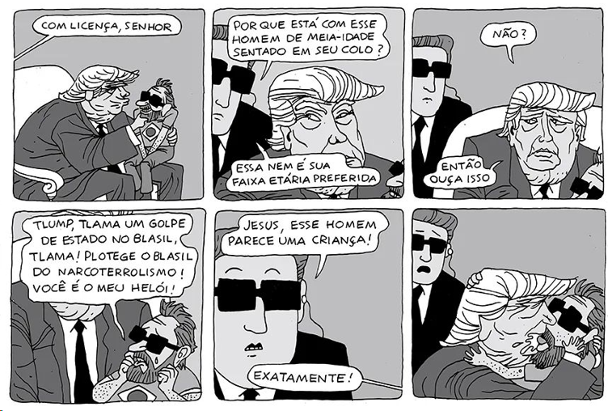

Tirinha de humor político em seis quadros. Um segurança pergunta a Trump por que carrega no colo um homem de meia-idade. Trump tira os óculos escuros e revela o motivo: o homem, chorando, declara que Trump vai "tlamar um golpe de estado no Blasil" e "plotegel o Blasil do narcoterrorismo", chamando-o de herói. O segurança comenta que o homem parece uma criança. Trump responde: "Exatamente!"

