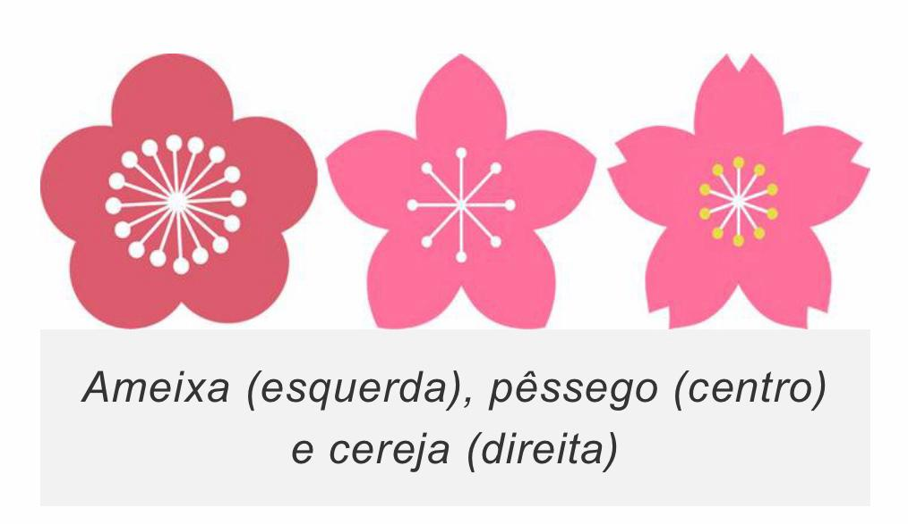

Anotações do sétimo encontro de Chinês Instrumental, conduzido por Si Fu com Claudio Teixeira e Thiago Silva. A sessão entrou no Mui Fa Jong 梅花樁 pelos três caracteres do nome: Jong 樁, Fa 花 e Moi 梅. Percorreu a estrutura radical-fonético usando Jong e Fa como par contrastante, trabalhou a ordem dos traços para o radical de madeira 木, abriu a simbologia da ameixeira pelas cinco pétalas e pela dicotomia galho-rígido/pétala-redonda, e chegou na leitura de Si Fu sobre o nível superior inicial do sistema.

### IA, dicionário e a derivação que afasta

Claudio apresentou uma análise de decomposição do ideograma [Jong 樁](/notes/etimologia-de-jong-zhuang-6a01/) feita com auxílio de IA. Si Fu foi direto: para etimologia, não tem coisa pior. Testou IA em etimologias que conhecia e a quantidade de imprecisões foi absurda. No caso do chinês especificamente não tem domínio suficiente para fazer a crítica item a item, mas sabe que tem muito absurdo.

O problema não é o erro óbvio. É o erro leve: "vai ser levemente errado. E se levemente errado, você nem vai perceber que está errado, o negócio vai afastando e fica muito ruim mesmo." Para algumas coisas IA é maravilhosa. Para etimologia, não.

A recomendação é buscar em dicionários especializados de chinês. E foi explícito quanto ao dicionário de papel: dá mais trabalho e fixa melhor.

### Estrutura dos ideogramas: radical e fonético

Si Fu voltou à estrutura geral dos ideogramas: um radical, que responde pela natureza do que está sendo nomeado, e um componente fonético, que carrega principalmente o som.

Uma forma prática de identificar os dois: dividir o ideograma ao meio verticalmente. De modo geral, o radical vai estar à esquerda e será mais estreito; o fonético vai à direita e invade um pouco o lado esquerdo. Isso não é regra absoluta. O [Fa 花](/notes/etimologia-de-fa-hua-82b1/), por exemplo, tem o radical em cima, não à esquerda. Mas, como orientação inicial, a divisão vertical funciona.

### Jong 樁: poste, pilar, metonímia

O radical de [Jong 樁](/notes/etimologia-de-jong-zhuang-6a01/) é 木, madeira, do lado esquerdo. Não quer dizer que todo Jong seja de madeira, mas o caractere aponta nessa direção. O componente fonético à direita remete a pilão, socar arroz. Si Fu foi explícito: esse componente está ali para dar o sentido fonético, não semântico.

O que Jong carrega é estabilidade e firmeza. O ideograma se estende por metonímia: a guarda de Jong nomeia a estabilidade que a posição carrega, não a posição em si. Como Jong tem muitas derivações de uso e muitas metonímias possíveis, a decupagem profunda do fonético não leva a lugar seguro. A chance de bater numa etimologia fantasiosa é grande.

Visualmente, Jong é fácil de memorizar: é praticamente o mesmo que o ideograma da primavera 春, com os dois primeiros traços abertos. A sequência de traços é diferente, o que faz a caligrafia ficar arredondada embaixo, mas batendo com o olho é muito fácil reconhecer.

### Fa 花: quando a decupagem funciona

[Fa 花](/notes/etimologia-de-fa-hua-82b1/) é o contraponto de Jong. O radical está em cima: 艹, o radical de grama. O componente fonético está embaixo: [化](/notes/etimologia-de-fa-hua-5316/) (*huà* em mandarim), que quer dizer troca, mudança, transformação. É o mesmo [化](/notes/etimologia-de-fa-hua-5316/) que aparece em câmbio de dinheiro.

Com esses dois componentes à vista, a leitura se sustenta: a flor é uma alteração da grama. "Ao invés de nascer grama, nasce flor."

### Caligrafia: a ordem dos traços

Si Fu pediu que Claudio escrevesse o radical de madeira 木 sem olhar. Claudio teve dificuldade em repetir a regra que acabara de enunciar.

A regra é de cima para baixo, da esquerda para a direita, de dentro para fora. Para 木: primeiro o traço vertical central descendo, depois o traço horizontal da esquerda para a direita, depois a diagonal esquerda de dentro para fora, depois a diagonal direita de dentro para fora.

Si Fu foi direto na exigência: "Se você não tiver capacidade de repetir o que você falou dez segundos atrás, a gente vai ter que parar."

Como tarefa para a próxima sessão, Claudio ficou com a prática da sequência de traços de Jong 樁 e [Moi 梅](/notes/etimologia-de-moy-mei/).

### Excelência no instrumental

Si Fu abriu com um exemplo: alguém que se propõe a dar aula de Kung Fu em Portugal e escreve os ideogramas mal produz o mesmo efeito que um técnico de futebol brasileiro que dá a aula toda em inglês errado, escrevendo o R ao contrário.

O total de ideogramas na língua é na casa de 50 mil. Um letrado circula com 25 a 30 mil. Para ler jornal, 6 a 7 mil. Para uso instrumental no contexto do Kung Fu, talvez muito menos, e tudo bem.

"Os 10 que você souber, saiba bem. E aí esses 10 vão virar 100 muito rapidamente. Porque esses 10 vão ser radicais de mais 10, cada um."

### Moi 梅: a ameixeira

[Moi 梅](/notes/etimologia-de-moy-mei/) em cantonês, Mei 梅 em mandarim. O radical é 木, madeira, do lado esquerdo, como em Jong. O componente fonético à direita é 母, mãe. Por isso o som puxa para "mou" ou "mui" em cantonês. Em mandarim, 母 sozinha ou repetida diz "mamãe", uma das primeiras palavras que qualquer criança aprende.

O que muda de 母 para 梅 é o radical de madeira: colocado ali, o composto passa a dizer árvore de ameixa.

A ameixeira chinesa tem características visuais precisas. As flores brotam diretamente do tronco e dos galhos, sem folhas. A estrutura da planta não tem tronco central bem definido; é como se fosse tudo galhos. Os galhos são muito angulares, muito rígidos. As pétalas são muito redondas. Si Fu: "Você imagina assim, aquela coisa toda dura e aqui nela já sai essa coisa redondinha."

### Ameixeira, cerejeira e a confusão da maioria

Si Fu tem uma comparação para a confusão entre flor de ameixeira e flor de cerejeira: é a mesma relação que existe entre "Wing Chun" (com WC) e "Ving Tsun" (com VT). A maioria das tatuagens, camisas e referências usa a cerejeira quando a referência cultural correta para o contexto do sistema é a ameixeira.

A distinção que IA e fontes genéricas costumam fazer é temporal: cerejeira marca o início da primavera; ameixeira marca o final do inverno. Si Fu pesquisou isso ao vivo e perguntou: "Qual a diferença? De final do inverno e início da primavera? Nenhuma. A rigor, nenhuma."

A diferença visual existe: pétalas da cerejeira são pontudas, angulares. Pétalas da ameixeira são perfeitamente redondas. Si Fu mostrou imagens comparando ameixeira, cerejeira e pessegueiro: as duas últimas têm pétalas com pontas; a ameixeira, não.

### As cinco pétalas e as cinco etnias

As cinco pétalas da flor de ameixeira representam as cinco etnias que formam a nação chinesa: Han 漢, Manchu 滿, Mongol 蒙, Tibetana 藏 e a minoria muçulmana 回. O símbolo carrega um programa de unidade nacional.

Os Han são a etnia predominante, na faixa de 92 a 94 por cento da população. Si Fu sinalizou que o termo "amarelo" para se referir a essa etnia é preconceituoso e foi criado nos Estados Unidos, não na China. Recomendou pesquisar num canal do YouTube que considera confiável no assunto. Normose: [O problema dos CHINESES ou "O PERIGO AMARELO VOLTOU?"](https://www.youtube.com/watch?v=mtNYcPqK1IQ)

A expressão *moi fa* 梅花 em cantonês, *méi huā* em mandarim, é usada para denotar civilização ou identidade cultural chinesa, não apenas a flor em si. Si Fu tentou mostrar isso numa busca ao vivo: a expressão emerge como termo para cultura chinesa.

Há uma pintura clássica da ameixeira nas quatro estações, descrita por Si Fu como análoga às quatro estações de Vivaldi: a mesma composição em quatro versões, uma por estação, com as cores da flor variando do branco ao amarelo, laranja e rosa. A tradição é trocar o quadro da parede antes de cada estação chegar. Si Baak Gung Miguel Hernandez tem as quatro versões e segue esse costume. Tanto Claudio quanto Thiago Silva buscaram a pintura durante a sessão sem encontrar a referência exata.

O gênero 四季花, *Flores das Quatro Estações*, associa cada flor a uma estação: ameixeira ao inverno, peônia à primavera, lótus ao verão, crisântemo ao outono. A série específica que Si Pek Miguel tem em casa não foi identificada durante a sessão.

### Contexto cultural e político do Mui Fa Jong

Termos carregam posicionamento. Si Fu usou exemplos brasileiros: "Havan" evoca algo; "Caetano Veloso" evoca outra coisa; "cultura woke" sinaliza de imediato quem está falando sobre o quê. Esse mecanismo não é moderno; é tanto mais intenso quanto mais tribal for o grupo.

O Ving Tsun se desenvolveu em boa parte durante o processo revolucionário na China, com os praticantes politicamente engajados na tentativa de restaurar a dinastia Ming contra a dinastia Qing, de origem manchu. O sistema era parte de um projeto de resgate de identidade chinesa, quase nacionalista no sentido do período. O símbolo da China, a ameixeira, é anterior a esse projeto; o Ving Tsun o incorporou ao próprio nome do sistema.

Si Taai Gung Moy Yat insistia nessa tecla: quando se translitera um termo, não se deve transliterar de acordo com a moda ou com a maioria, porque sem perceber pode-se estar abraçando outro discurso. "Ving Tsun" (com VT) e a grafia com WC não são intercambiáveis; refletem linhagens e projetos distintos. Usar a grafia da maioria sem consciência pode criar dissonância dentro do próprio grupo.

### Jong e Moi: estabilidade e transformação

Si Fu fechou com a leitura que é a sua, explicitamente apresentada como interpretação pessoal, não como transmissão direta.

Um dos símbolos centrais da ameixeira é a transformação. O nome Mui Fa Jong 梅花樁 parece uma incoerência: Jong puxa para estabilidade e estrutura; Fa e Moi puxam para transformação e mudança.

A leitura proposta para o nível superior inicial do sistema: consolidar a capacidade de se transformar e, sobretudo, de transformar o que em si é fixo. O trabalho é com o que está enrijecido. "Você pode alterar, transformar e ajustar aquelas coisas que em você são fixas."

O outro polo também conta: não ser volátil, não ser disperso. Consolidar a capacidade de ajuste não é dissolução permanente.
