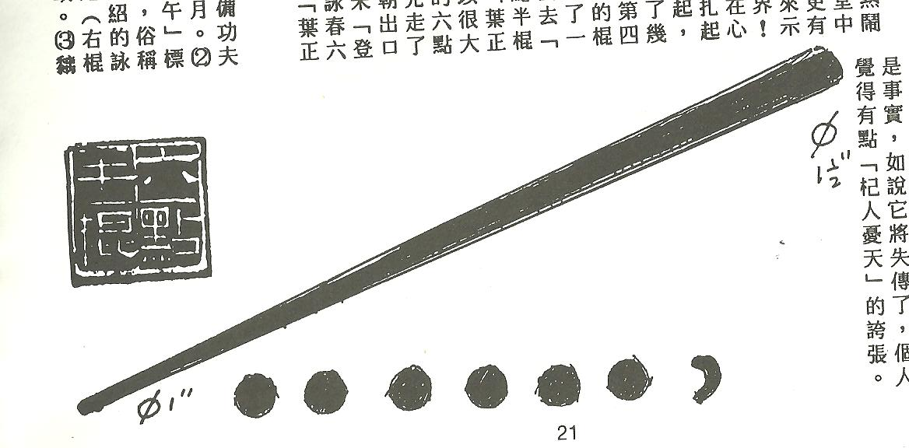

Anotações do oitavo encontro de Chinês Instrumental, conduzido por Si Fu com Claudio Teixeira e Thiago Silva. A sessão continuou com a prática de caligrafia ideográfica, aprofundou os ideogramas Quan 棍 e Dim 點, e chegou na leitura de Si Fu sobre os pontos do Luk Dim Pun Kwan 六點半棍: projeções da ponta do bastão, não áreas nem ângulos fixos.

### Gestalt e autoridade no ideograma

Si Fu retomou o ponto da [sessão anterior](/notes/vii-encontro-chines-instrumental/): reconhecer o ideograma ao bater o olho. O objetivo não é maestria acadêmica em língua chinesa, é ter convicção prática sobre o que se fala. "Não é autoridade externa. É interna mesmo."

A comparação foi com leitura de partitura. Quem estuda piano começa sem entender o que são bolinhas e traços. Depois de um tempo passa a ver o conjunto inteiro e já sabe as posições dos dedos, sem decompor nota por nota. A língua chinesa precisa seguir esse caminho: fechar o todo, e dentro do todo ir reconhecendo radicais e fonéticos.

Si Fu testou o Duolingo e considera contraproducente para esse nível de estudo. O aplicativo cria ilusão de saber sem fixar de fato: o caractere fica preso ao contexto do app, não à memória visual autônoma.

### Caligrafia: ferramenta certa para o estágio

Claudio relatou dificuldades com a caneta de nanquim: traço fino demais fica impreciso, traço mais grosso não cabe no quadrado. Si Fu foi direto: usar caneta comum ou lápis. Para aprender a escrever e reconhecer o caractere, o instrumento é secundário.

O que importa nesse estágio é trabalhar expressão: movimento com a mão, não precisão do traço. Si Fu evocou o filme Herói, o caligrafo que escreve na areia com movimentos amplos e quase marciais.

Thiago comentou que trabalhar com quadrados maiores ajuda: dá mais espaço para variar o traço e desenvolver a consciência espacial do ideograma. Si Fu endossou e observou que a melhora na escrita de Claudio já estava visível.

### Quan 棍: madeira, sol, comparação

Si Fu apresentou o ideograma Quan 棍 como o mais importante dos quatro do Luk Dim Pun Kwan 六點半棍. A composição: 木 madeira à esquerda, 日 sol à direita, e abaixo o componente de comparar, o ideograma de colocar uma coisa ao lado da outra.

Claudio havia usado uma ferramenta de decupagem de software que identificou parte do ideograma como "faca". Si Fu descartou. A parte de baixo não é faca: é o componente de comparação. O componente de comparação, visto invertido, tem o contorno de uma faca, e foi isso que o software encontrou.

Para memorizar, Si Fu propôs uma mnemônica com as mãos: árvore, sol, e o L duas vezes com o dedo que falta. "O L com o dedo faltando é o dedo do Lula. É porque é o segundo mandato."

### Dim 點: gota e marcação

Dim 點 não é ponto geométrico. A origem mais remota do caractere é a gota que cai repetidamente sobre uma pedra e vai fazendo um buraco. É uma indicação, uma marcação: o efeito de algo que tocou.

Si Fu foi honesto: não sabe a razão do componente "preto" no lado esquerdo do ideograma. "Eu não sei a razão desse escuro." Para o contexto do bastão, o que importa é o sentido de marca e de consequência de uma ação.

### Os seis pontos: o debate

Claudio mapeou a sequência fisicamente e chegou em ângulos: quatro ângulos principais, o ângulo de disparo, um meio ângulo. Thiago trouxe a analogia com o passo: o meio ponto seria uma técnica que não se completa em si mesma, como no Jing Choy, onde dois meios de passo perfazem um passo inteiro.

Si Fu calibrou os dois: Dim não é área, não é ângulo. É ponto mesmo. Micro, como a gotinha que cai na pedra.

No meio do percurso, Si Fu sinalizou o tema "den galinha" para aprofundar em sessão futura. (TODO conferir: "den galinha", tema que Si Fu indicou para retomar)

### Pun Dim 半點 e imperceptibilidade

Si Fu contou que perguntou a uma professora de chinês da PUC, sem dar contexto, o que seria "pundinho". A resposta: coisa rápida. Vapt-vupt.

Si Fu foi preciso: não é rapidez. É imperceptibilidade. "Quase nada." A professora sabia que Si Fu praticava Kung Fu, mas ele propositalmente retirou o contexto para não influenciar a resposta.

Pun 半 aparece também em meio-dia, meia-noite: marcações precisas de tempo. Por isso a professora pode ter associado ao tempo. Mas o sentido coloquial que ela deu foi: algo que passa quase sem ser percebido.

Essa conversa, segundo Si Fu, aconteceu há mais de quinze anos. "Isso não foi transmitido nem pelo Si Gung, pelo Si Taai Gung, por ninguém. É a minha leitura."

### Disparar para o próprio ombro

A proposta de Si Fu: os pontos do Luk Dim Pun Kwan não são alvos a atingir, são consequências dos disparos. O primeiro disparo vai na direção do próprio ombro, não em direção ao oponente. A ideia é apontar o ombro e disparar na linha do ombro.

Se acertar, acertou. Se o oponente saiu, fez certo e deu errado porque ele saiu. A partir do ponto marcado pelo primeiro disparo é que se desdobra o próximo.

Si Fu comparou ao jab do boxe: o primeiro disparo funciona como medida para o que vem a seguir. Tentar acertar um alvo externo a qualquer custo causa desequilíbrio. Si Fu citou o Gwan Mo Leung Heung 棍無兩響 como referência de prática: praticando essa forma, dispara-se muitas vezes a partir do ponto marcado pelo disparo anterior.

### Projeções da ponta, não caminhos contínuos

Os pontos se marcam pela ponta do bastão, não pelo risco que o bastão faz no ar.

Ao executar a sequência, o que conta é onde a ponta projeta, não o trajeto entre uma posição e outra. Si Fu demonstrou: ao fazer cada técnica, o bastão não está traçando linhas. Está fazendo pontos. O percurso entre os pontos não conta como ponto.

O Pun Dim 半點, o meio ponto, não se consegue contar como um ponto pleno porque não é uma projeção da ponta: é o movimento intermediário que conecta os pontos.

Si Fu recomendou que Claudio pegasse o bastão e praticasse a sequência com atenção na ponta. A sequência estava um pouco esquecida; a tarefa é rememorar e observar as projeções, não os caminhos.
