Anotações do décimo terceiro encontro de Chinês Instrumental, conduzido por [Si Fu](/notes/os-dois-si-fu/), com Claudio Teixeira, Thiago Silva e Daniel Araújo. Como Daniel tinha perdido parte do caminho já percorrido, o encontro começou retomando a decomposição de [Sam Faat](/notes/xii-encontro-chines-instrumental/), passou aos cinco elementos e aos domínios do sistema, e fechou no cuidado com as fontes e na leitura de interno e externo.

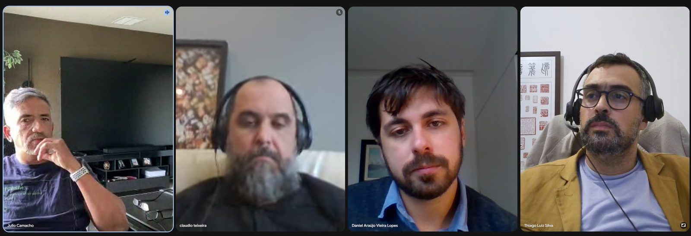

### O ideograma dentro do quadrado

Si Fu abriu lembrando por que gosta de etimologia. Ela ensina a pensar melhor. Como a proposta da série é a questão instrumental do chinês, entrar na origem das palavras é sempre bom caminho.

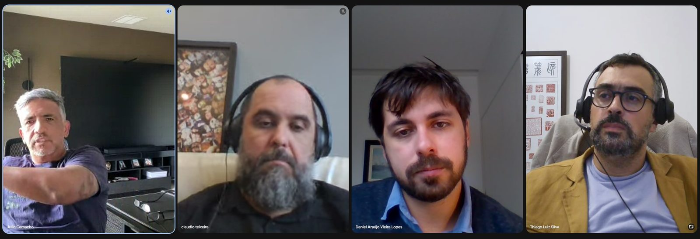

Segundo Si Fu, todo ideograma chinês cabe dentro de um quadrado, ponto já registrado no [encontro anterior](/notes/xii-encontro-chines-instrumental/). Daniel já tinha baixado as folhas quadriculadas e estava experimentando, e ficou combinado mandar no grupo para ele dar uma olhada. A folha com a cruz e o xis, indicou Si Fu, é a mais útil, porque mostra exatamente onde fica cada traço.

Ainda segundo ele, o ideograma normalmente tem dois ou três blocos. Quatro é possível, mas raro. Uma parte costuma ser mais fonética e outra mais conceitual, estrutura que as notas de etimologia da casa registram como composição fonossemântica, e o ideograma pode ser decupado. Para a parte que carrega o sentido existe o termo raiz, equivalente ao que a etimologia ocidental chama assim.

Quando um ideograma vira raiz de outro, ele muda de forma. [Yan 人](/notes/etimologia-de-yan-ren-4eba/), pessoa, fica em pé quando entra como raiz. A isso se chama forma lateral.

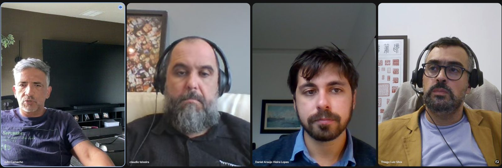

### Faat: a água que varre

Os três pauzinhos à esquerda de [Faat 法](/notes/etimologia-de-fat-fa/) são a forma lateral de [Seoi 水](/notes/etimologia-de-seoi-shui-6c34/), água. O ideograma cheio de água tem quatro traços, com o gancho no meio, e parece espelhado sem ser: cada perninha é um traço próprio.

O lado de cá, na demonstração de Si Fu, é fonético, e quer dizer retirar, remover. Para ele, esse ideograma já não é usado com esse sentido hoje, e há várias outras maneiras de escrever remover.

O que água e retirar têm a ver com método? Daniel tentou por um método em que tirar a água fosse essencial. É o contrário, e esse é o aviso que Si Fu repete sobre pensar em chinês: pense o inverso do que daria em português. Trata-se de usar a água para retirar. Melhor ainda, de usar a água para varrer.

Uma das teorias etimológicas de Faat apresentadas por Si Fu é a de jogar água para varrer alguma coisa para fora. Quanto mais intenso o processo, mais ele se aproxima da imagem de uma torrente: naquela corrente forte, a coisa é expulsa e não tem como escapar. Daí a dureza e a inevitabilidade que o termo carrega, ponto que já tinha aparecido no encontro anterior.

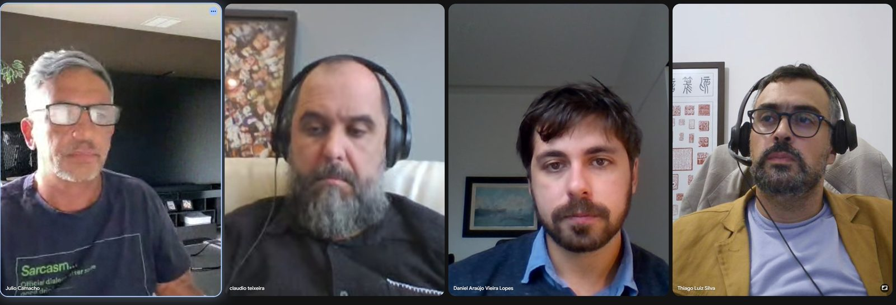

### Cinco elementos, não quatro

Atrás de Thiago Silva, na chamada, havia ideogramas arcaicos. Um deles, invertido pela câmera, dizia Ving Tsun 詠春, e ao lado vinha Moy Yat Kung Fu. Os ideogramas antigos pegam mais elementos da natureza. O segundo ideograma de Ving Tsun traz um sol embaixo e, mais atrás no tempo, o broto tentando subir da terra. Quanto mais arcaico o ideograma, mais ele se apoia em madeira, metal, água, terra e fogo.

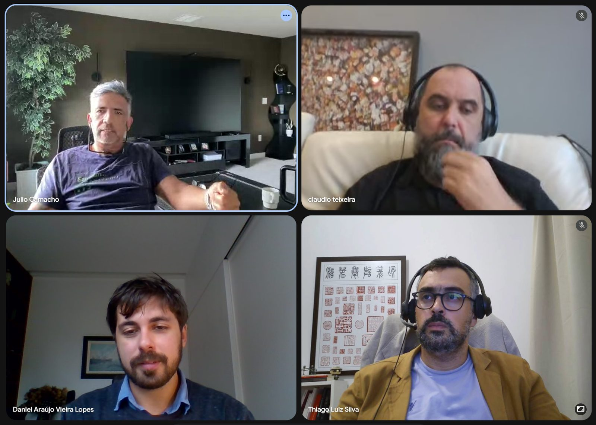

Si Fu enumerou os [cinco elementos](/notes/etimologia-de-haang-hang-884c/) chineses, terra, água, fogo, madeira e metal. O Ocidente costuma falar de quatro, terra, água, fogo e ar. Na lógica chinesa, disse ele, o ar não conta, e entram metal e madeira.

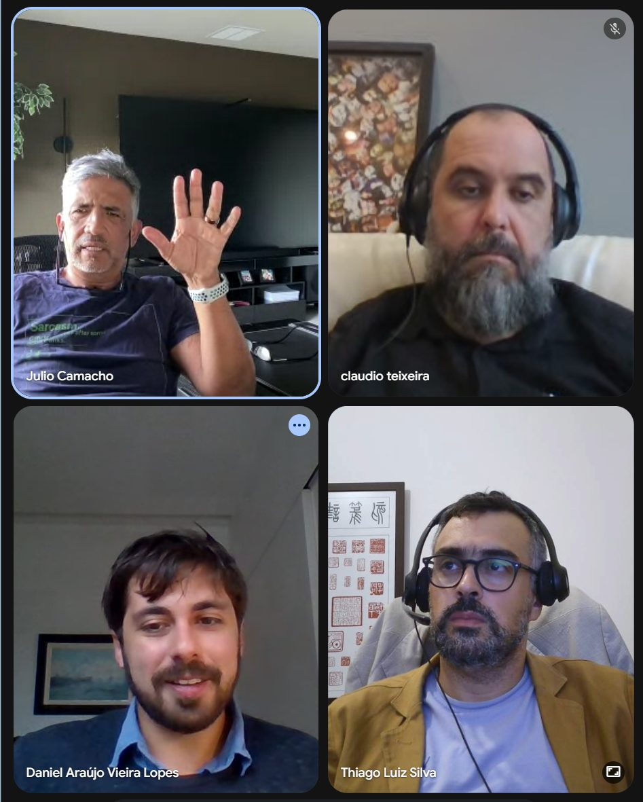

Si Fu descreveu ciclos que rodam em sentidos opostos, um construtivo e outro destrutivo, e surgiu na aula a comparação com pedra, papel e tesoura. A lógica destrutiva corre assim, a terra encobre a água, a água apaga o fogo, o fogo queima a madeira. Thiago Silva mostrou um quadro de geração e inibição, e Si Fu observou que não era exatamente o ciclo que tinha em mente, embora a lógica fosse a mesma. Há ainda uma terceira relação, que liga elementos em pontas opostas de uma estrela, e que ele não lembrava como funciona.

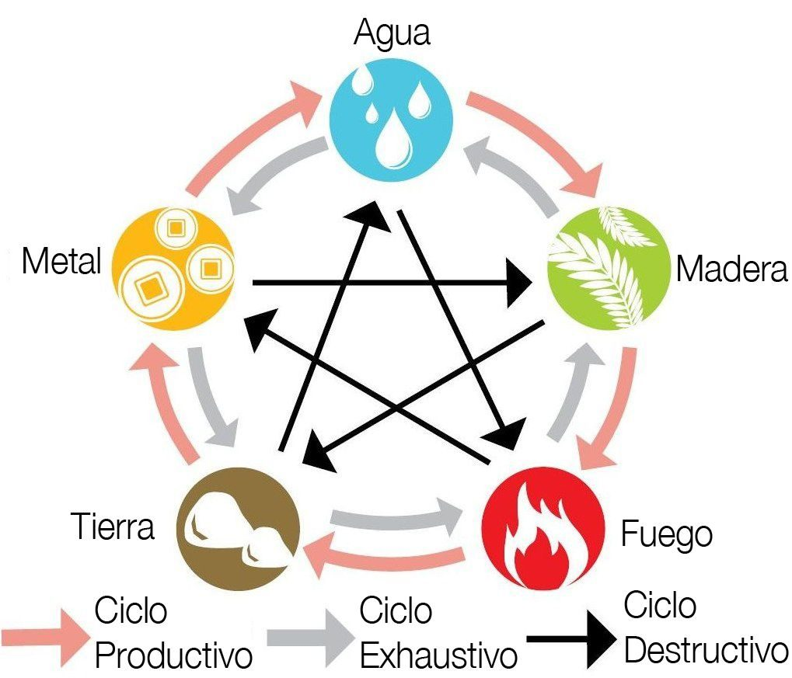

No sistema, a ordem que Si Fu usa é terra, água, fogo, madeira e metal.

### Três energias dentro do homem, duas fora

Desses cinco, os três primeiros estão contidos no homem. [Tou 土](/notes/etimologia-de-tou-tu-571f/), terra, é a parte concreta: ossos, músculo, carne, cabelo. Água são os fluidos, suor e sangue. [Foh 火](/notes/etimologia-de-foh-huo-706b/), fogo, é o calor e os humores, no sentido de disposição, de ânimo, de vontade.

Daniel tentou dividir os dois grupos pela manipulação humana, e Si Fu redirecionou: a divisão é entre o que está contido no homem e o que lhe é externo.

A carne é muito mais visível que a água do organismo, ainda que a água seja a maior parte dele. Surgiu na aula o número de 72%, que Si Fu sempre achou papo furado e aceita para não virar negacionista, achando estranho que ninguém consiga cuspir nem 5% do próprio peso. Mesmo assim, a circulação de água existe sem se deixar enxergar. Não se desidrata um pedaço, desidrata-se por inteiro, e a água bebida vai para todo o organismo, não só para o tubo que ela molha.

O fogo é mais invisível ainda. Cientificamente o calor do corpo tem a ver com circulação sanguínea e com as regulações do organismo, mas dentro da lógica chinesa existe uma outra circulação, que não é só física. Segundo Si Fu, a depressão, para a medicina chinesa, teria a ver com temperatura muito baixa, como se faltasse energia quente, yang, circulando.

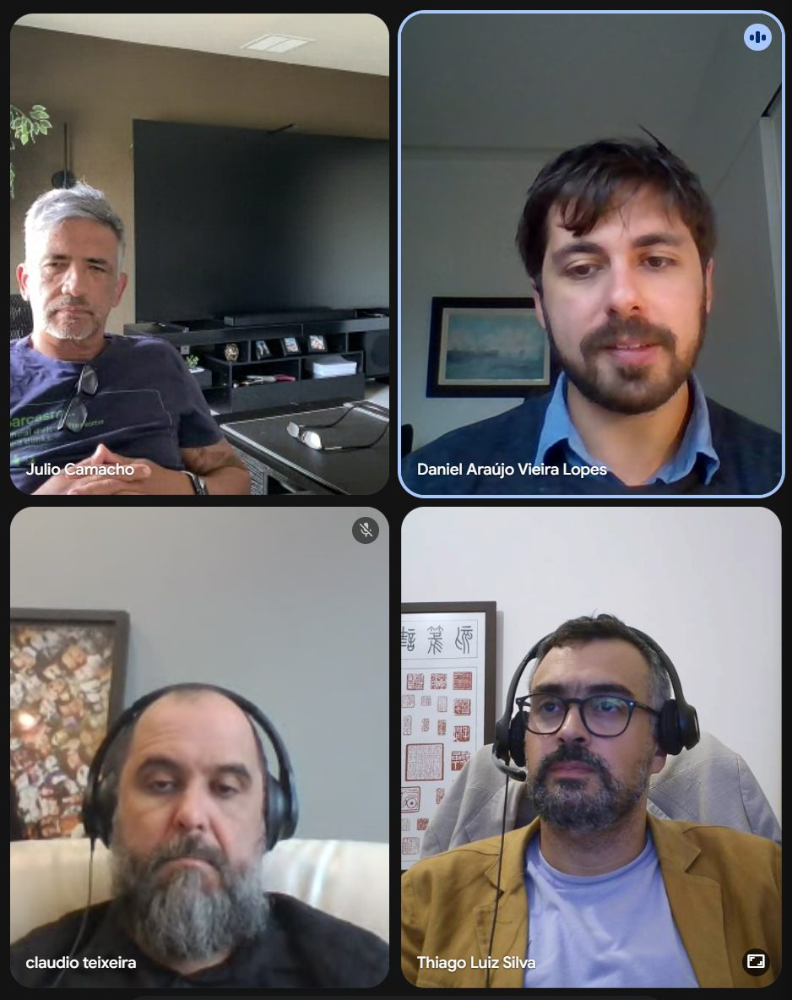

Claudio lembrou de uma fala antiga de Si Fu sobre essa mesma energia: quando a pessoa morre, perde temperatura e entra na temperatura do ambiente. Lembrou também a referência ao branco como cor do luto para o chinês, ligada à perda da coloração da pele.

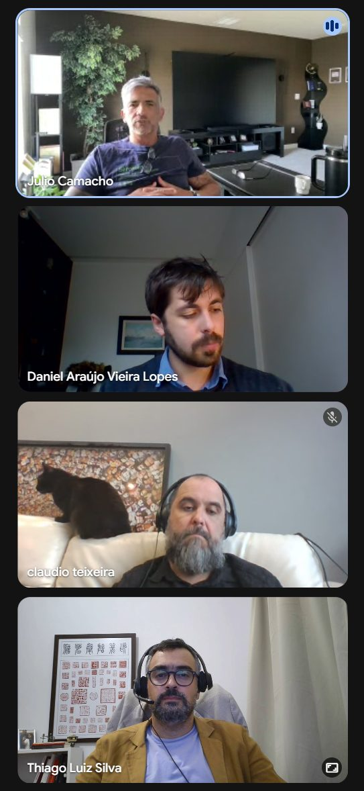

Madeira e metal ficam de fora do homem. Seria fácil intuir que a madeira representasse o osso, e não é o caso: osso, cabelo e músculo estão todos na categoria terra, que vai do concreto para o abstrato.

### O ideograma de humanidade 仁

Completado o ciclo das três energias humanas, a investigação para dentro chega ao seu limite. Para se configurar como humano, a pessoa precisa estar em contato com outra da mesma espécie.

Na leitura que Si Fu apresentou, o ideograma de humanidade, 仁, junta a forma lateral de [pessoa](/notes/etimologia-de-yan-ren-4eba/) ao número dois.

Si Fu deu o exemplo do cachorrinho prestes a ser atropelado. Salvar o cachorro não faz de ninguém um ser humano melhor. É um ato de bondade, e pode dizer de uma pessoa boa, mas humanidade tem a ver com a relação entre pessoas.

### Os domínios lidos pelos elementos

A primeira palavra do [Siu Nim Tau](/notes/etimologia-de-siu-nim-tau-xiao-nian-tou/) é raiz, e raiz é o que entra na terra. Quem não tem nenhum trabalho de Kung Fu tem como primeiro trabalho enterrar, literalmente: entrar na terra, entrar na energia da terra. O primeiro Jiu Sik 招式 da primeira sequência é o Yi Ji Kim Yeung Ma 二字鉗羊馬, que é agarrar o solo e criar raiz. É o maior indício de que a energia trabalhada ali é a telúrica.

[Cham Kiu](/notes/etimologia-de-cham-kiu-xun-qiao/) diz respeito à fluência. Si Fu recorreu a um passeio de barco em Angra, para onde Claudio o levou: uma das qualidades do barco é estar sempre em reequilíbrio, nunca parado. Em terra dá para pousar os dois pés no chão sem compensar nada, a menos que o solo esteja instável. Na água a estabilidade não existe, e a compensação é obrigatória, com aquele pêndulo, aquele jogo.

A essência do Cham Kiu é a troca inteligente para se manter equilibrado. Equilíbrio como estado deixa de ser equilíbrio: quando fica estático, perde-se o dispositivo que o faz existir. Fazendo Cham Kiu, o peso vai para um lado e gira, vai para o outro e gira, sempre trocando.

Cham, no sentido de procurar, tem várias traduções possíveis, e Si Fu prometeu voltar a elas. Procura-se a ponte para atravessar a ponte. E se atravessa uma ponte, e não um caminho, um túnel ou uma estrada, porque o caminho passa no nível do solo, o túnel passa por baixo e a ponte passa por cima. O que passa debaixo da ponte é água.

[Biu Ji](/notes/etimologia-de-biu-ji-biao-zhi/) é o mais intuitivo dos três. O termo explosão aparece o tempo todo, e o domínio é o mais dinâmico. É também o que mais aquece. Si Fu contou que, nas manhãs na casa dele, com Siu Nim Tau, Cham Kiu e Biu Ji feitos cedo, às vezes o sol ainda está começando a nascer e a pessoa já está suada. Suar não é o ponto, e cansar menos ainda. O que importa é a entrada em calor do corpo, porque em tese há energias sendo ativadas.

Cada domínio deixa uma sensação específica. Terminado o Siu Nim Tau, a sensação aparece na perna, no braço, no quadril, na cabeça, no punho. No Cham Kiu, nas juntas: quadril, joelho, ombro, cotovelo. No Biu Ji, o calor. Daniel, que está indo agora para o Mui Fa Jong 梅花樁, confirmou a diferença. Praticando Biu Ji fica sem fôlego e suado.

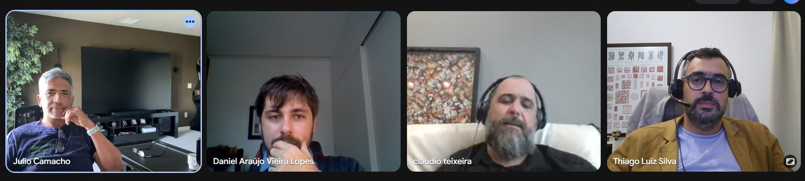

### Do boneco morto ao boneco vivo

Concatenadas as três energias do homem, elas são projetadas num homem inanimado. No Muk Yan Jong 木人樁, Muk é [madeira](/notes/etimologia-de-muk-mu-6728/), Yan é pessoa e [Jong 樁](/notes/etimologia-de-jong-zhuang-6a01/) é estaca, pilar. O apelido do Muk Yan Jong, contou Si Fu, é Sei Jong, e [Sei 死](/notes/etimologia-de-sei-si-6b7b/) quer dizer morto. É o primeiro dispositivo do nível superior inicial, na fase chamada semi-estrutura.

Na sequência que ele apresentou, o último componente do Mui Fa Jong é o [Maai](/notes/etimologia-de-maai-mai-57cb/) Saang Jong 埋生樁. Maai quer dizer aproximar e [Saang 生](/notes/etimologia-de-sang-sheng/) quer dizer vivo, podendo ser também crescer. O boneco está vivo e vem na direção de quem treina. Começa-se pelo Sei Jong e termina-se no Saang Jong.

Si Fu mandou no grupo o ideograma de Saang. Quando três traços aparecem em sequência, é comum, embora não seja regra, que se trate de uma alusão a Terra, Homem e Céu, e no caso do Saang é isso mesmo. A parte de cima é o broto da árvore, daí a ideia de vivo e de crescer.

Depois do Jong vêm madeira e metal. Thiago Silva observou que a madeira aparece duas vezes, no Jong e no Kwan, e que a diferença está no estado dela: no primeiro a madeira está parada e cabe a quem treina animá-la, no segundo ela está na mão e se mexe. O caminho termina na faca, no metal.

O metal tem simbologia de corte, e é onde se corta inclusive o vínculo com o próprio sistema. O Kung Fu passa a se desenvolver pela relação Kung Fu, não mais pelo dispositivo sistêmico. O sistema continua existindo, e é justamente com ele que é preciso cortar para seguir, sob pena de ficar numa fase ainda muito material. Si Fu tem falado disso no grupo e pretende elaborar melhor mais adiante.

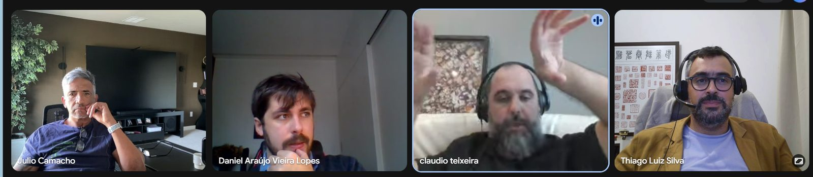

Daniel lembrou do quadro dos níveis que havia no Núcleo Ipanema e que não se adota mais no Mo Gun 武館. No topo, o quadro terminava com o Dou e depois o Sam Faat, como um corte do sistema para a vida Kung Fu.

### A elasticidade da interpretação

Daniel notou que Faat compõe o ideograma da água e o da terra, os dois domínios, e perguntou onde estaria o fogo. Si Fu interrompeu ali mesmo, com o alerta que já tinha dado a Claudio no começo da série: cuidado com a elasticidade da interpretação.

O ideograma é anterior ao sistema Ving Tsun, anterior ao Siu Nim Tau, ao Cham Kiu e ao Biu Ji. Uma coisa não foi feita em função da outra.

O exemplo que ele repete é o do português, com guarda-chuva, guarda-roupa e guardar as coisas. São palavras que guardam relações entre si, e não dá para usar isso de forma científica ou matemática. Esse tipo de associação serve muito mais para gravar o ideograma do que para interpretá-lo a fundo.

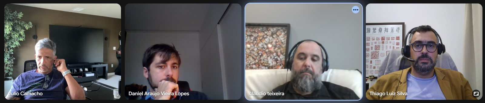

### Etimologia serve para lembrar

Por coincidência, no mesmo dia a professora de chinês da época da PUC mandou mensagem a Si Fu depois de muito tempo, e ligou para ele no meio do encontro. Ele lembrou de uma aula dela. Na aula dela, livro em Mandarim é shu, e a explicação que ficou foi a do som, o livro fala shu, shu, shu. Ele já tentou mil vezes e nunca conseguiu tirar o shu de um livro. A explicação é mnemônica, e serve ao que ele busca quando estuda origem de palavra, que é criar mecanismo de lembrança, além do prazer de saber.

Si Fu separou então dois campos. Na cultura ocidental, a etimologia tangencia o que se chama de ciência, com um dado estrutural, da linguagem, que é matemático e tem fórmulas, e um dado cultural, feito por inferências. A etimologia histórica é diferente da etimologia linguística, e as duas compõem o campo. No chinês, para ele, existe só o lado histórico, e por isso a etimologia chinesa é mais imprecisa, com versões distintas de um mesmo processo etimológico aparecendo mais do que no Ocidente.

Daí a quantidade de etimologias fantasiosas em circulação. Comemorar como comer e orar é uma delas. Um membro da família emendou uma das melhores, dizendo que Deus é o somatório de "de" e "us", e concluindo que isso prova que Deus é brasileiro, porque só a língua portuguesa faz essa conta.

Claudio trouxe o guarda-mancebo, termo de marinha que, segundo ele, nomeia a grade em volta do passadiço do barco. Explicou que mancebo é o jovem, geralmente quem trabalha no entorno, nas partes mais expostas, e que o guarda-mancebo existe para impedir que ele caia.

Si Fu citou ainda a explicação corrente para a expressão "casa do caralho", que ligaria o termo a um dos nomes possíveis do mastro e ao cestinho de observação no alto, um dos piores postos do navio. Ele mesmo ressalvou não ter certeza, dizendo haver pesquisadores sérios que apontam essa etimologia como fantasiosa, assim como a do criado-mudo.

### O livro, a internet e a IA

Si Fu mostrou na câmera o *Ideogramas e a Cultura Chinesa*, de Tai Hsuan-An, artista plástico chinês naturalizado brasileiro, publicado pela É Realizações em 2006. O volume vai sempre aos arcaicos e traz um índice completo dos caracteres antigos no fim. Recomendou a compra a quem tiver oportunidade, e o classificou como fonte muito confiável.

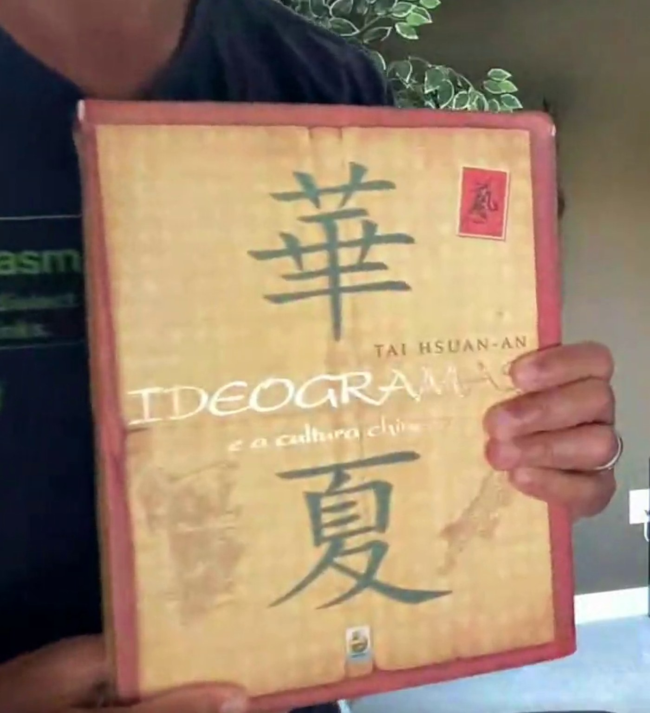

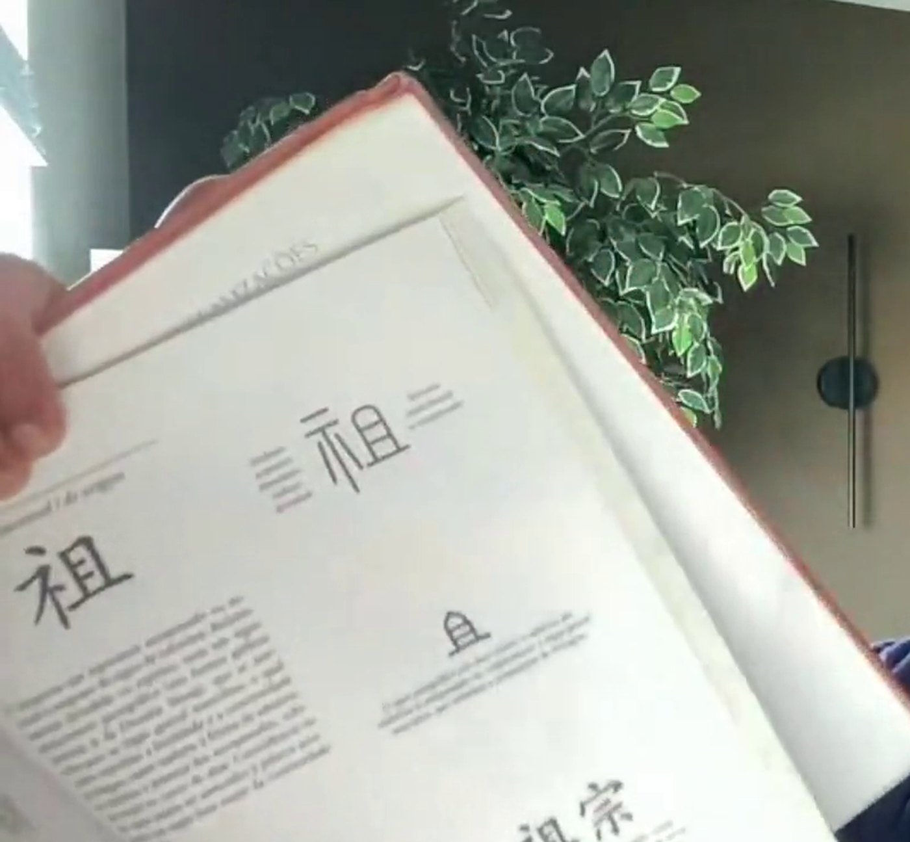

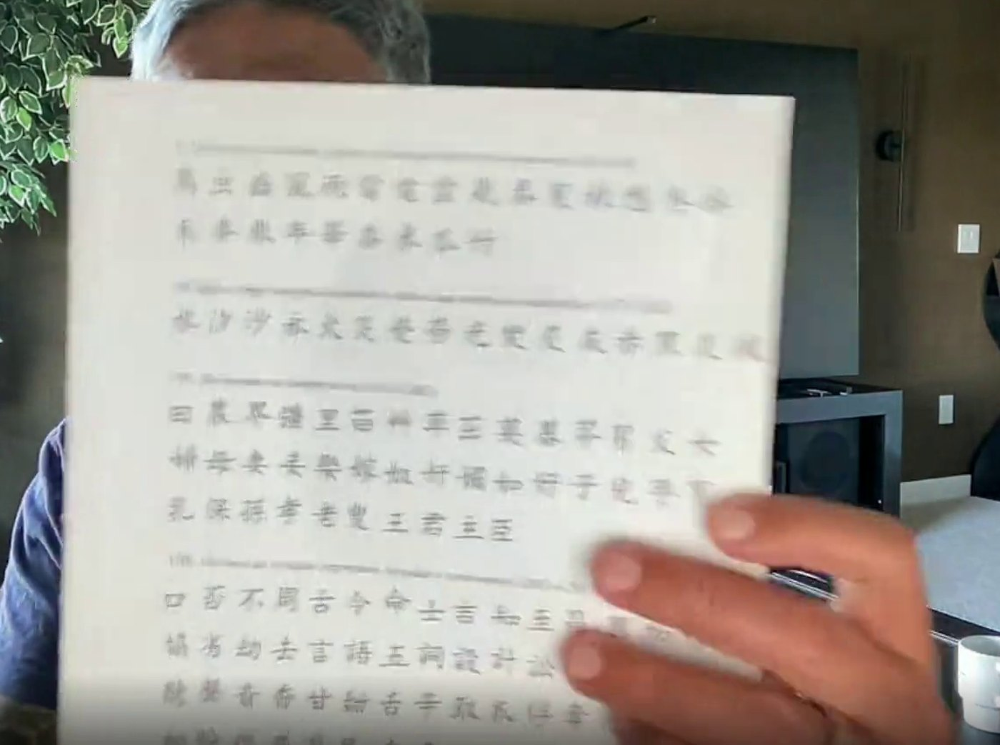

Si Fu argumentou que obra publicada por editora séria passa por uma série de revisões, e responde por isso de um jeito que um site não responde. O MDBG é bom site e é confiável, mas não é completo e é muito rápido. O melhor é buscar livros.

O alerta maior foi com a inteligência artificial, e Claudio trouxe o caso. Na ida ao Recreio com Daniel, fez o teste no carro para mostrar a ele a precisão da coisa. Perguntou várias coisas sobre Kung Fu, e a IA acertou algumas e errou outras. Depois começou a inventar, e ela passou a confirmar as invenções. Pediu que falasse sobre o mestre Julio Camacho, e ela falou, inclusive coisas que deve ter pescado por aí. Pediu que falasse dos mestres formados por Si Fu, inventou uma lista de nomes, e a IA confirmou que todos eram discípulos e diretores de núcleo.

Ao ser confrontada, ela pede desculpa e afirma o oposto do que tinha dito. Consultando assim, dá para se afastar mais do que se aproximar.

Em chinês o problema fica mais delicado. Há muito material em chinês na internet, e a capacidade de tradução é grande, mas, de acordo com a cultura, uma coisa pode ser o oposto dela mesma. No Feng Shui existe a Escola do Norte e existe uma outra escola, cujo nome Si Fu não lembrava e que tem chapéu no nome, e elas dizem coisas rigorosamente opostas em vários pontos. Ambas são muito respeitadas. Uma mandaria dormir com a cabeça para o leste, a outra para o oeste, pela mesma explicação. Si Fu brincou que a IA que consulta as duas tira a média e manda virar a cabeça para o sul.

Buscando um ideograma, ela vai puxar de tanto lugar que faz uma salada. O risco está nos 10% errados que ninguém percebe e passam no bolo.

### Interno e externo são direção, não lugar

Si Fu comentou que, no uso corrente, chama-se de energia externa o que aparece em coisas como o Karate, muito forte, e de energia interna o Tai Chi. Si Fu está na corrente minoritária que lê o par como direção: energia para fora e para dentro. Se vai para fora, veio de dentro. Se vai para dentro, veio de fora, e é energia internalizada.

Para ele, comercialmente ficou mais interessante dizer que um estilo é interno. A palavra parece mais sofisticada, enquanto externo soa superficial, voltado para o outro. Ninguém se arroga externo. Por isso aparece gente de Tai Chi defendendo que Tai Chi é externo, ao contrário do senso comum, enquanto o Hung Gar, mais vigoroso, fica com a fama de externo.

E o Ving Tsun? A resposta que se escuta sem pensar é semi-interno, meio de caminho que Si Fu considera ridículo. O teste foi feito ali mesmo. Perguntado, o ChatGPT respondeu que o Ving Tsun é tradicionalmente classificado como externo, Wai Gaa 外家, com características que se aproximam de princípios internos. Provocado sobre o semi-interno, respondeu que o termo é invenção de quem perguntou, e que a classificação clássica é entre Wai Gaa 外家 e Noi Gaa 內家. Si Fu gostou da resposta e a achou coerente, já que o Ving Tsun é reconhecido com elementos de um lado e de outro e procura equilibrar os dois processos.

### O que fica para a próxima

Na semana seguinte o encontro volta ao horário normal e retoma o Siu Nim Tau. Claudio ficou encarregado de preparar uma aula de dez minutos sobre o domínio, com base apenas no que já foi visto na série, sem pesquisar nada fora. Thiago Silva ficou com o Cham Kiu.
