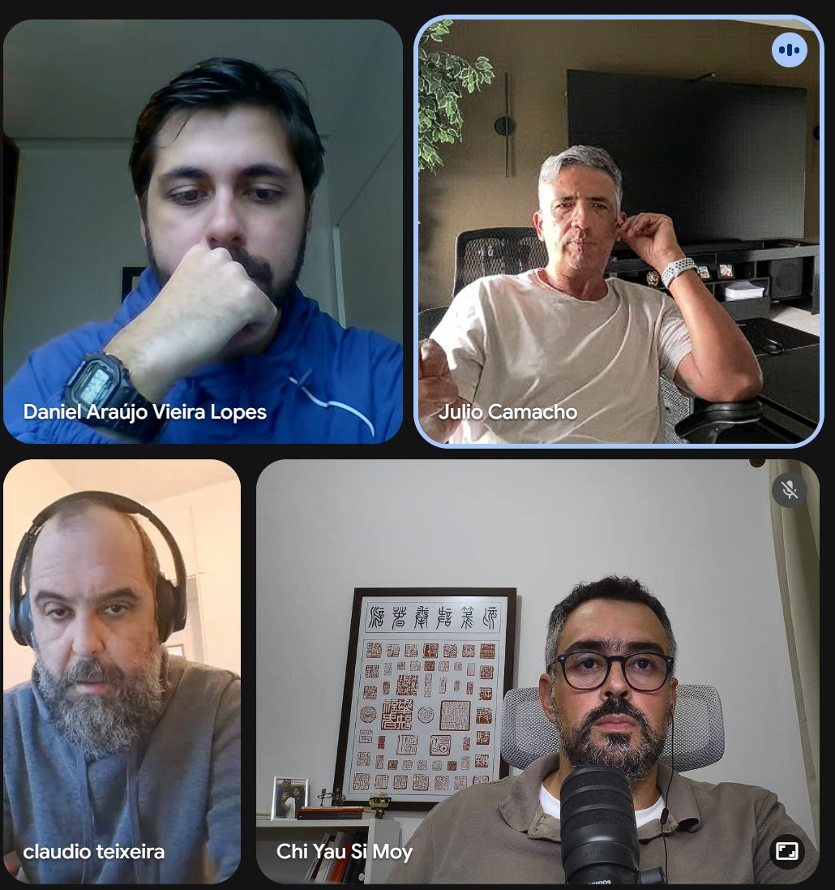
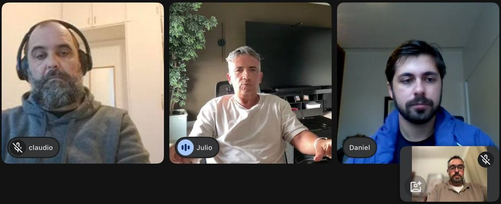
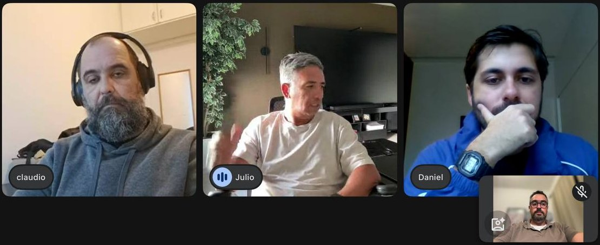
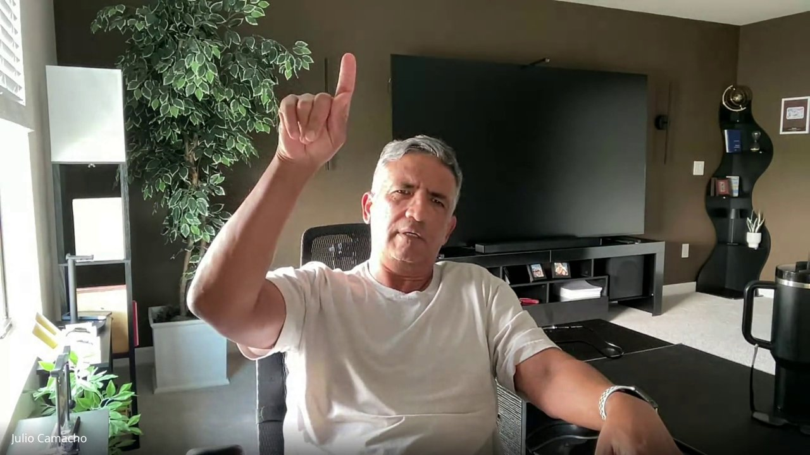
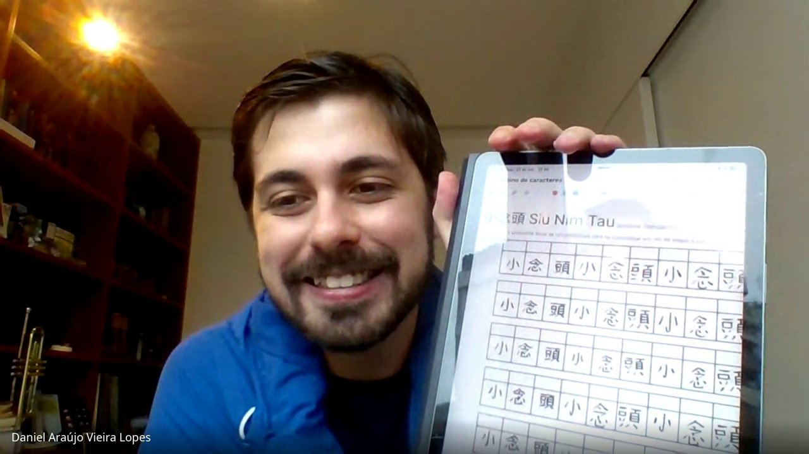
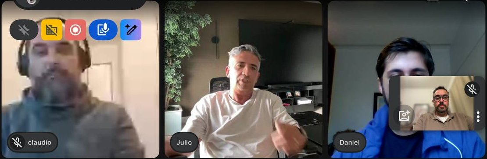
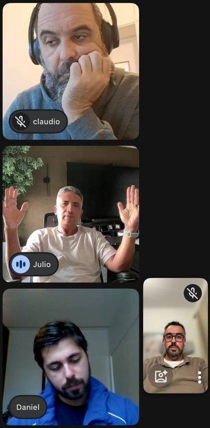
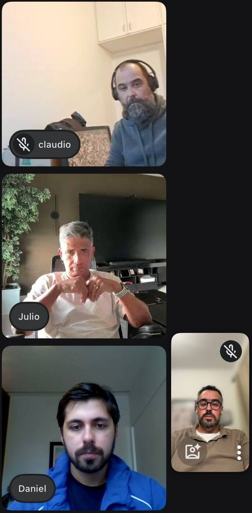
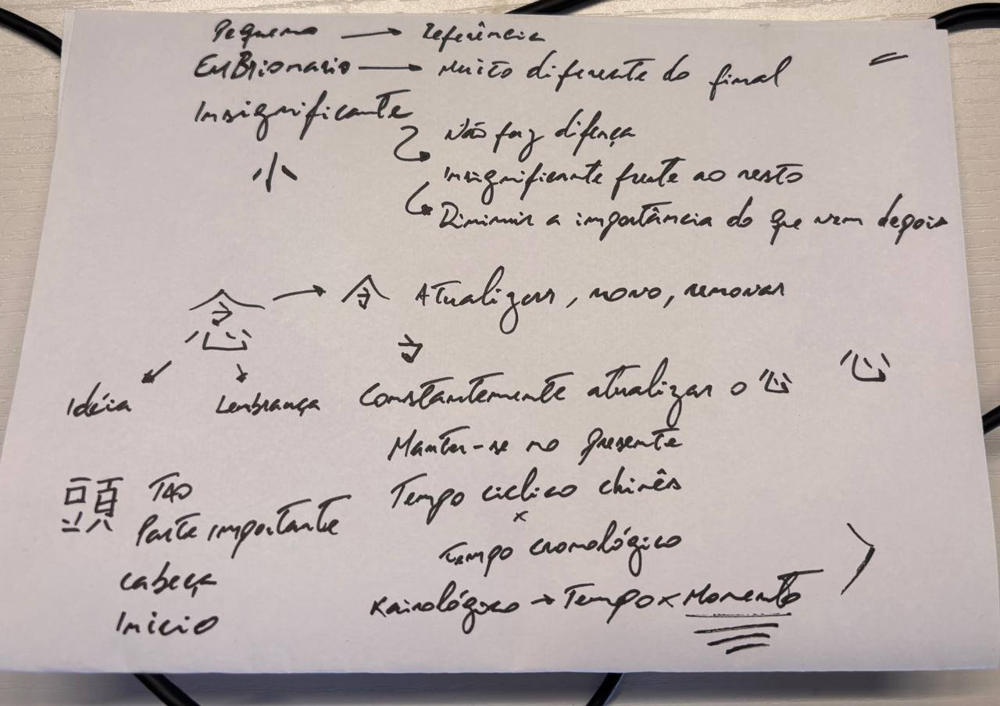
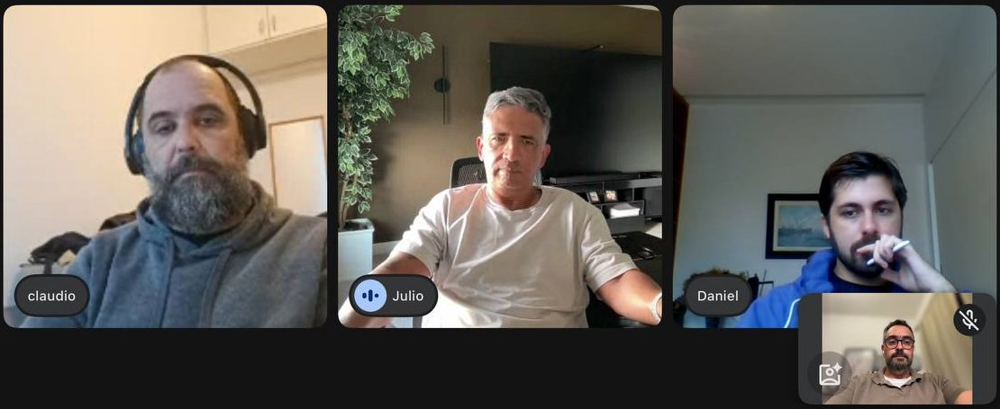

Anotações do décimo quarto encontro de Chinês Instrumental, conduzido por [Si Fu](/notes/os-dois-si-fu/), com Claudio Teixeira, Thiago Silva e Daniel Araújo. O encontro revisou para Daniel os três termos de Siu Nim Tau 小念頭, já vistos no [III Encontro](/notes/iii-encontro-chines-instrumental/), e abriu um longo desvio sobre o tempo na perspectiva chinesa antiga. Os ideogramas ficaram de lado: Si Fu indicou a Daniel o material que Thiago Silva preparou sobre o tema, e usou a aula para reforçar os significados na própria voz.

### Siu Nim Tau como nome e como termos

A proposta da série é o chinês como instrumento, para os termos do sistema e também para interpretar a cultura e o pensamento chinês.

Siu Nim Tau é, antes de tudo, o nome de uma coisa, um todo, como se chama qualquer coisa pelo nome. Mas os termos também podem ser abertos nos sentidos que oferecem. Siu sozinho pode querer dizer muita coisa, Nim e Tau também, e Nim Tau junto já quer dizer outra. Nesse arranjo, Siu vira qualificativo de Nim Tau.

Si Fu insistiu que essa separação é talvez a essência da forma como a família traduz Siu Nim Tau, e que por isso ele repete, repete, repete.

### Siu: pequeno e embrionário

Siu tem, grosso modo, três sentidos claros. A primeira resposta foi "apequenar", e Si Fu observou que isso já é um pedaço da história lá na frente: apequenar é o Siu agindo sobre o Nim Tau, não o sentido do termo sozinho. A resposta que ele esperava era a dos três sentidos, [pequeno, embrionário e insignificante](/notes/siu-pequeno-embrionario-insignificante/).

Claudio lembrou um exemplo antigo de Si Fu: tem quase um metro e oitenta, é um cara grande, e diante do Maracanã é minúsculo. Si Fu arrumou a casa. Pequeno é sempre relativo a algo maior, que a gente chama de grande; Claudio é grande em relação à formiga e pequeno em relação ao Maracanã. E pequeno não carrega em si a ideia de crescer: uma árvore pequena pode ficar grande, um animal pequeno pode crescer e continuar pequeno, mas o termo não promete nada.

Embrionário é pequeno em relação a si mesmo, ao que vai ser no futuro, e pressupõe desenvolvimento, transformação em outra coisa. Si Fu comparou com uma foto ampliada: cresce, deforma, mas guarda as características de quando era pequena. O embrião faz o contrário, e a forma final guarda quase nenhuma semelhança com a inicial. O embrião humano de Daniel é muito diferente do Daniel adulto.

### Siu: o insignificante e o fio de barba

O terceiro sentido se abre em dois. Insignificante, ao pé da letra, é o que carece de significado próprio, e por isso acaba sem importância para outras coisas. Uma pluma posta em cima de um telefone, ou de um peso de 50 quilos, é insignificante: quase não altera o peso, e não muda o fato de os 50 quilos serem pesados. Aquilo que não fede nem cheira.

Mas o insignificante também pode tornar outra coisa insignificante, reduzindo a importância dela. Si Fu deu o exemplo de alguém lendo um livro, a quem se diz que aquilo é completamente insignificante para o Kung Fu dele: a frase reduz o valor do livro.

O fio de barba junta as duas pontas. Um fio a mais ou a menos na barba de Claudio é insignificante, não faz diferença. O mesmo fio caído na sopa de Thiago Silva pode fazer a sopa ir para o lixo. Daniel tinha arriscado que o insignificante não é o que não tem valor, e Si Fu aproveitou a palavra: esse fio pode ser extremamente valioso, com valor negativo, mas valor. Por isso Siu é chamado de qualificador; qualifica a coisa como menor.

Esse é o processo que Si Fu chamou de polissêmico: o mesmo termo significa coisas diferentes, e dentro da polissemia cabem interpretações que mudam muito.

Daniel ainda tentou formular o insignificante como algo que não se deve diminuir, mas que se deve deixar um pouco de lado mesmo sabendo que tem conteúdo. Si Fu marcou esse pedaço como perigoso e refez a explicação pelo fio de barba.

### Precisão do gesto, precisão do pensamento

No meio da revisão, Si Fu explicou por que vinha cobrando Claudio na forma de explicar cada sentido, além de focar em Daniel. É importante ter clareza na transmissão e um trato preciso com as palavras.

A precisão é um dos dispositivos do Kung Fu. A precisão do gesto vem da precisão do pensamento, e a precisão do pensamento se treina fazendo o que se faz a maior parte do tempo: produzindo palavras. Quem pensa "vou fazer tal coisa" pensa numa sequência de palavras que apontam para uma ação.

Si Fu propôs o teste de pensar em algo que não seja palavra. Veio a árvore, e a pergunta seguinte: o que se pensou? Palavras. Para ele, talvez uma das principais coisas do pensamento seja a produção de palavras dentro de contextos.

### Nim: atualizar o Sam

Si Fu desenhou o Nim 念 com a mão para Daniel, que tinha feito o dever de casa e mostrou o ideograma na câmera: em cima a casinha, o chapéu, o traço e o gancho; embaixo o coração, [Sam 心](/notes/etimologia-de-sam-xin-5fc3/), já discutido em encontros anteriores.

A parte de cima, 今, tem a ideia de atualizar, e pode ser também novo, porque o atual foi renovado. Si Fu trouxe o exemplo do nome de Si Gung. Segundo ele, em japonês essa parte se lê *ima*, e *mura* é vila, de modo que Imamura 今村 seria, em português, Vila Nova, ou Villeneuve em francês (que alguém na aula achou mais chique).

Si Fu foi explícito sobre o tipo de novo. Novo aqui é atualização: dentro de uma cadeia temporal, o momento mais próximo, mais moderno, mais perto de quem vive, em renovação constante. **Nim é atualizar o Sam.**

O oposto é o envelhecimento, e Si Fu brincou com o papo de "no meu tempo, antigamente" das pessoas mais velhas, e com quem ainda escreve textão no Facebook achando que alguém lê. A avó de Daniel escapou: trocou o Facebook pelo Instagram. Por envelhecimento, Si Fu entende tudo o que já passou do seu tempo.

### O tempo que atravessa

Si Fu partiu da afirmação de que, na perspectiva chinesa antiga, não existe a noção linear de passado, presente e futuro, e o tempo era entendido mais como cíclico do que linear. Daniel arriscou que o chinês não evolui, que sempre volta ao passado para refletir, e Si Fu corrigiu: essa roda também é evoluir, e a evolução não é necessariamente linear.

O chinês atual também divide o mundo em passado, presente e futuro, mas aponta diferente. No Ocidente o passado ficou para trás e o futuro está lá na frente. Na lógica chinesa que Si Fu descreveu, o futuro está atrás e o passado está na frente.

O presente é o lugar onde a pessoa está. O futuro fica atrás porque nunca se consegue vê-lo, e se estiver muito distante não dá nem sinal. À medida que chega perto, dá sinais, barulho, cheiro, gosto, até ser percebido com todos os sentidos. Depois vai se afastando para a frente, e por isso há mais memória de ontem do que de cinco anos atrás. Si Fu ressalvou que existem memória de curto prazo, de longo prazo, de trabalho; mas, via de regra, o que acabou de passar está mais à vista e à escuta, e o que vai ficando distante passa a ser completado com imaginação.

O ocidental se vê como o ativo do processo. Ele envelhece, gerencia o próprio tempo, caminha para o seu futuro, enquanto o tempo fica parado, e isso costuma gerar mais ansiedade. Na lógica chinesa, a pessoa é um grão de areia parado na praia, e o tempo a atravessa sem dar a mínima para ela. O português guarda um resto disso na expressão "o tempo passou por mim": eu parado, o tempo se movendo.

Si Fu observou que as duas visões, quase invertidas, continuam lineares, só que em sentidos opostos.

### Cronos e kairós

Esse tempo linear é o que se chama, com base no grego, de tempo cronológico, de Cronos, o titã que devora os próprios filhos. Somos devorados pelo tempo, pelo nosso pai Cronos.

A outra perspectiva é a do tempo kairológico, de *kairós*, que Si Fu atribuiu, com hesitação, a Agostinho de Hipona (TODO conferir a atribuição de kairós a Agostinho; a nota [tempo-em-agostinho](/notes/tempo-em-agostinho/) trata do *distentio animi*). Nesse tempo o que importa é o momento, e não a passagem linear. O momento é inextensivo, e perguntar quanto tempo dura um momento não faz sentido. O mesmo momento, que gasta o mesmo tempo, pode ser muito mais duradouro para Daniel do que para Claudio.

Si Fu lembrou a piada da relatividade atribuída a Einstein, que ele frisou não ser de Einstein: esperar na porta do banheiro é uma coisa, estar ao lado de uma mulher bonita é outra.

Si Fu somou a isso a observação de que a cultura chinesa não foi atravessada por Aristóteles, e explicou a medição aristotélica: a bolinha sai do ponto A e chega ao ponto B. A primeira coisa que se mede é a distância, que é a mais simples; depois se mede o tempo que o deslocamento levou, e daí vem o movimento. Com isso o tempo começa a ser empilhado: dia 1, dia 2, dia 3, dia 20.

### Ciclos: o salário, o ano 1000 e os 120 anos

Si Fu recorreu ao salário para mostrar o ciclo dentro da linha. Quem recebe todo dia 30 está cheio de dinheiro no dia 1 e vai perdendo até o dia 29, já triste. No dia 30 renova. Linearmente, quanto mais se avança, menos dinheiro; mas há um ciclo acontecendo, e a coisa fica meio redonda. (Daniel é autônomo e recebe honorários, então o exemplo foi hipotético.)

Numa sociedade agrícola isso fica mais claro. Numa perspectiva linear, o ano 1010 é mais parecido com o ano 1000 do que o ano 2000. Numa perspectiva cíclica, o verão do ano 1000 é mais parecido com o verão do ano 2000 do que com o inverno do ano 1001, e para quem planta isso importa mais, porque cada estação tem seu procedimento. **O tempo cíclico aponta para o momento: há momento de fazer cada coisa**, diferente de empilhar 40, 41, 42, 43 anos.

Surgiu na aula a ligação com o ano novo chinês, o ano do dragão, do cavalo, e Si Fu confirmou. Importa menos se o ano é 10 ou 40, e mais qual é o signo do ano, no sentido linguístico de signo. Os signos se repetem em grandes ciclos. Na conta de Si Fu, 12 animais com 5 elementos dão 60, e duas polaridades levam a 120, quando o ciclo se renova (TODO conferir a conta do ciclo).

Daí a ideia do homem sábio como aquele que viveu pelo menos 120 anos, porque passou por todos os signos possíveis do tempo. Não há na literatura quem tenha chegado a 240, mas esse compararia ciclos e teria uma visão mais precisa; aos 360, mais ainda. Ninguém sabe tudo o tempo inteiro, mas quanto mais perto dos 120, mais oportunidades de perceber os diferentes signos da natureza.

Si Fu fechou o desvio retomando os dois tempos: o cronológico devora o que está para trás, ou para a frente, nesse caso; o kairológico é de respeito ao momento, de como se extrai ou se frui aquele momento.

### Nim no tempo: ideia, pensamento, lembrança

Com isso Si Fu voltou ao Nim, que também toma [três sentidos](/notes/nim-ideia-pensamento-lembranca/). Claudio chegou à ideia e à atualização, e Daniel só lembrava de ideia. Si Fu perguntou em qual registro a ideia cabe, passado, presente ou futuro. Veio a resposta "presente".

Si Fu desmontou pelo cinema. Quem vai ver um filme vai porque tem uma ideia do filme, e ainda não o viu. Depois de ver, passa a ter uma conclusão, um saber sobre o filme, que é o que se chama pensamento. Daniel já tinha assistido *Odisseia*, e por isso não tem mais uma ideia do filme: sabe como é.

Toda atividade cerebral pode ser chamada de pensamento, mas dentro desse termo a ideia é o pensamento a futuro: imaginar, transformar em imagem, significar algo que ainda não se sabe. Surgiu na aula a leitura de idealizar, e Si Fu concordou, no sentido platônico: um mundo de ideias a alcançar, distante, enquanto o mundo sensível, da percepção, ficaria com Aristóteles.

Faltava o passado, e Daniel completou: lembrança. Nim pode ser ideia para o futuro, pensamento para o presente e lembrança para o passado.

### Tau: cabeça, início, o mais importante

Com o tempo avançando, Si Fu abreviou o [Tau](/notes/tau-cabeca-inicio-guarda/). Literalmente é cabeça. Dizer que Claudio é o cabeça do grupo não fala da cabeça física: fala de quem está à frente, acima, de quem é o principal. Si Fu viu o mesmo sentido no "head de operações" das empresas, que em português seria cabeça de operações, e o tratou como um termo chinês. Contou ainda que o ideograma se baseia na cabeça de um animal, de um boi.

Claudio perguntou se Tau seria o mais importante ou aquilo que guarda o mais importante, lembrando uma fala anterior. Si Fu disse que pode ser isso, mas deixou o desdobramento para depois, por falta de tempo.

A cabeça, para o chinês, é o início. Si Fu comparou com o desenho de um prédio: no Ocidente se desenha da base para o topo; o chinês desenha do topo para a base e depois põe o chão. Tau fica então com três sentidos: cabeça, início e mais importante. As conjugações, emendando um termo no outro, ficaram para a semana seguinte.

> [!NOTE] Pesquisa posterior
> O Shuowen define 頭 como "首也。从頁豆聲": cabeça, com 頁 (cabeça de pessoa) como radical e 豆 como fonético. Ver [Etimologia de Siu Nim Tau](/notes/etimologia-de-siu-nim-tau-xiao-nian-tou/). A leitura da cabeça de boi, trazida em aula, fica para conferir com Si Fu.

### O que ficou do encontro

Si Fu pediu a cada um o que ficou.

Para Thiago Silva, o tempo cíclico chinês parecia óbvio, mas era difícil de explicar, e a diferença entre tempo e momento pareceu a chave. O chinês está no momento, e não preocupado com o tempo: o momento da colheita, o momento disso, o momento daquilo. A colheita pode levar seis meses, e isso não importa. O tema ficou anotado para pesquisa.

Claudio contou que já tinha ouvido essas ideias muitas vezes, em momentos diferentes, como uma colcha de retalhos, mas nunca concentradas num conceito só. Ficou com a referência de como o tempo passa pelo momento dele: o tempo caminha, e ele percebe o momento, idealizando enquanto percebe.

Si Fu devolveu a Claudio uma orientação. Quando tenta lembrar um termo, Claudio costuma se atrapalhar e pôr outra coisa no meio. O remédio é se habituar a explicar: logo que a aula termina, escrever em três parágrafos as três possibilidades apresentadas para Siu, para Nim e para Tau (não que só existam essas). Escrever grava muito mais do que entender mais ou menos, passar para outra coisa e depois tentar lembrar sem registro.

Daniel ficou curioso com a conjugação dos sentidos. Para ele, Siu Nim Tau era sempre "pequena ideia", e agora via, por exemplo, a associação fácil entre embrionário e ideia, porque o embrionário traz uma ideia de futuro, de algo que vai ser gerado. Dá para fazer uma análise combinatória de significados.

Si Fu confirmou, e disse que foi por isso que não quis fazer as combinações naquele dia: seria corrida. Ficou como gancho de série para a semana seguinte. Enquanto isso, o nome do que Daniel pode fazer é estudo: tentar ele próprio as combinações, para analisar junto depois. Com três sentidos para cada termo, a conta rendeu discussão na aula (três fatorial, nove, até chegar a três ao cubo, 27 combinações). Algumas não vão agregar nada, vão ser só cosméticas; ainda assim o exercício traz a precisão que Si Fu tenta encontrar por meio das palavras.

Si Fu confirmou também a vinda ao Brasil, com o evento num sábado e o Programa de Mestrado presencial na segunda-feira seguinte, com a ideia de que já exista material para um encontro bem construtivo.
