Anotações do décimo quinto encontro de Chinês Instrumental, conduzido por [Si Fu](/notes/os-dois-si-fu/), com Thiago Silva e Daniel Araújo, e com [Guilherme Farias](/notes/moy-faat-lin/) entrando na metade. O encontro se dividiu em duas partes: a primeira tratou dos ajustes no formato da série, e a segunda voltou ao Siu Nim Tau 小念頭, agora nas combinações dos sentidos que o [XIV Encontro](/notes/xiv-encontro-chines-instrumental/) deixou para depois.

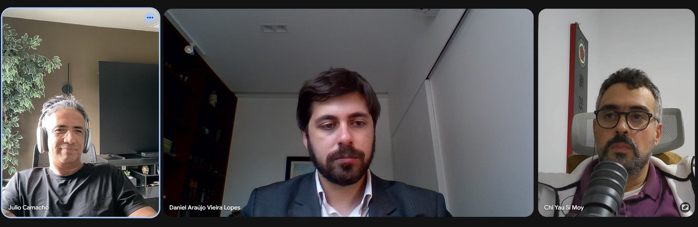

## Parte 1: os ajustes do encontro

### Repensar o formato

Si Fu propôs repensar o formato ao mesmo tempo em que se traz mais gente para o time, vendo se é isso que se mantém, se é para ajustar ou para refinar. Thiago Silva pensou em chamar Guilherme. Daniel já tinha se colocado sobre o tema no grupo.

Quanto ao valor, Si Fu quer que a coisa seja justa. Não gosta, e sobretudo não quer estimular na família Kung Fu, o processo em que a pessoa fica com a sensação de "me dei bem, ganhei", uma certa malandragem. Para quem não tem isso, ele opera de outro jeito. A intenção é que o encontro chegue a mais pessoas e chegue com a devida valorização. Se for preciso ajustar o valor, ajusta-se; se for preciso pensar outros formatos, pensam-se outros formatos.

Si Fu chamou de base da família o *vamos ajustar, vamos melhorar sempre*. O ponto vai além do dinheiro e do evento. Se três pessoas estão juntas ali, são as três que decidem.

Daí uma frase que ele acha interessante, ressalvando que não pode ser tomada como universal: **os ausentes nunca têm razão**. A frase não diz que os ausentes estão sempre errados. Diz que não têm razão porque não participam da racionalidade daquele processo. É uma forma de estimular a presença e, sobretudo, de premiar a presença.

### Programa de Mestrado estendido, grupo mais ativo

Thiago Silva disse gostar da proposta original de Claudio, de usar o cantonês como ferramenta para aprender a pensar como chinês, mas que sempre viu o encontro como um Programa de Mestrado estendido, e nunca entendeu por que os outros irmãos não aderiram. Os encontros mais abertos, em formato de colóquio, costumam deixar as pessoas inibidas, e um formato um pouco mais restrito talvez funcione melhor.

Veio aí o desvio sobre a palavra panelista, que circula em podcasts brasileiros e que Si Fu nunca tinha ouvido. Thiago Silva achava que, pelo português, o certo seria painelista.

Thiago Silva defendeu ainda a restrição de quem fala. Quando se dá voz a todo mundo, muita gente nem quer falar, acaba não vindo na próxima, e o encontro se alonga. Ele gosta que ali se encerre no tempo certinho, e lembrou da [reunião pós-evento](/notes/ata-reuniao-pos-evento-2026-09-09/), em que Daniel foi cortando todo mundo para pôr ordem na bagunça. Online, mais de uma hora cansa. A proposta dele era manter o horário enxuto, abrir para o restante do Programa de Mestrado e seguir com o cantonês como linha guia, falando dos domínios, como vem sendo feito com Daniel. Isso garantiria pelo menos seis encontros para rever o formato e pôr todo mundo na mesma sintonia. Quanto mais a família souber, melhor.

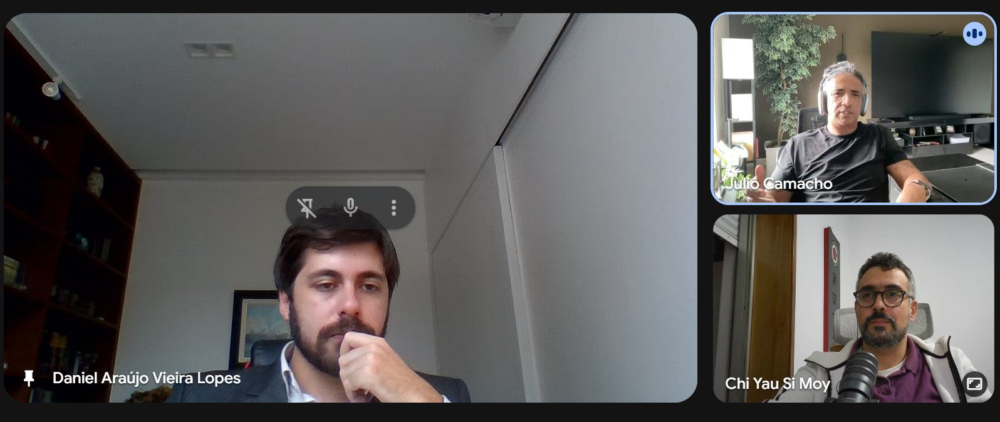

Daniel contou que quem lhe apresentou a proposta foi Claudio, ainda no começo da série, e que só entrou quando conseguiu tempo para se dedicar. Também defendeu chamar mais gente, aproximando o modo do Programa de Mestrado. A proposta dele de atualização é ter um grupo mais ativo, com devolução, para o encontro não ficar só na uma hora semanal. Si Fu tinha sugerido que ele mandasse os ideogramas que treina para receber retorno, e Daniel admitiu que não mandou. Leitura de texto e exercício de ideograma no grupo, com essa devolução, enriqueceriam o encontro semanal. Daniel sugeriu receber tarefas concretas, do tipo "Daniel, você consegue fazer tal coisa esta semana para a gente conversar na próxima?", como Claudio tinha ficado de apresentar o Siu Nim Tau. Ele também faz resumo escrito, como Thiago Silva, e poderia postá-lo no grupo.

### Novo nome, novo horário, aula aberta

Si Fu fechou a parte estrutural. A série pode trocar de nome, apoiada no que Thiago Silva falou. Si Fu contou que fez uma pós-graduação na PUC cujo nome, se não era exatamente, era quase Idioma, Cultura e Pensamento Chinês, e imaginou um nome parecido, orientado para o Kung Fu. Ficou encomendado a Daniel e a Thiago Silva pensar como fazer.

A segunda decisão foi comunicar a atividade no grupo do Programa de Mestrado, por quem tiver mais eficácia para isso.

O nó era o horário. Si Fu preferia manter dia e hora, e queria evitar fim de semana. Thiago Silva, em Portugal, consegue até as 20h do Brasil, meia-noite para ele. Si Fu sugeriu mais cedo, 18h na Flórida, 19h no Brasil, e lembrou que lá trabalha até as 16h e, sem trânsito, está em casa às 16h30 ou 17h, a ponto de ter dificuldade de lembrar do Rio engarrafado às sete e meia. Quarta-feira, que já é o dia do encontro, serve a Daniel. E no horário em que há atividade no Mo Gun 武館, o pessoal pode participar de lá, já que o encontro é remoto. Daniel estará no Mo Gun nesse horário.

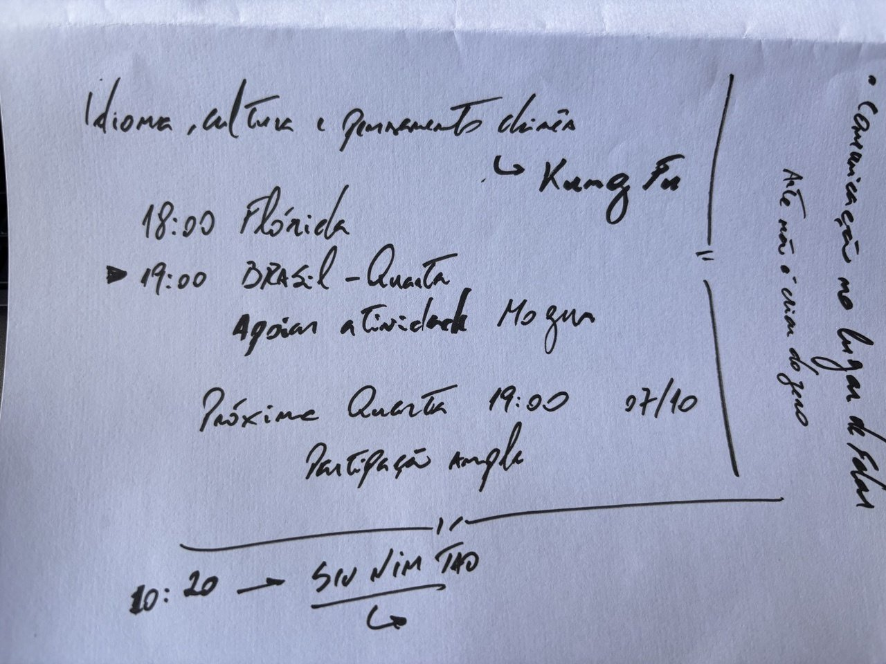

Na quarta seguinte, 07/10, às 19h do Brasil, o encontro tenta o novo horário, transmitido a partir do Mo Gun, convidando quem estiver lá. Daniel ficou de divulgar o máximo possível, como aula aberta para todos de um curso que Si Fu já dá a Daniel, Thiago Silva e Claudio, de cultura e pensamento chinês orientado para o Kung Fu. Quem quiser vai ao Mo Gun, e quem não puder entra pelo link. Daí em diante, Thiago Silva vai filtrando.

### Guilherme convocado

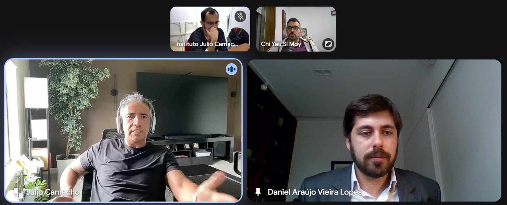

Guilherme entrou já com o Siu Nim Tau andando, e Si Fu pediu a Thiago Silva e a Daniel que gastassem um tempo, depois que ele saísse, sintonizando Guilherme com as viradas do dia. Resumiu para ele a mudança, que é transformar o curso de cantonês num curso de pensamento baseado na língua, a partir dos termos instrumentais do Kung Fu, falando de cultura e de pensamento.

De Guilherme, Si Fu espera participação ativa. Em alguns encontros, Si Fu vai pedir que ele se apresente, como Thiago Silva fez naquele dia. E, a cada encontro, quer que Guilherme gere um material e o publique antes do encontro seguinte. Naquele dia, como chegou tarde, a tarefa foi assistir à gravação. Si Fu avisou, rindo, que tem um programinha que detecta se alguém jogou o vídeo numa ferramenta para resumir.

### Depois da saída de Si Fu

Depois que Si Fu saiu, Thiago Silva explicou a Guilherme que ele tinha sido convocado, sem desculpa de horário nem de dinheiro. Tinha dito a Si Fu que havia uma pessoa que deveria estar ali e nunca estava, e Si Fu concordou. Guilherme disse que sentia falta desses encontros com Si Fu.

Na conversa sobre quem fica no Mo Gun às quartas às 19h, apareceram Daniel e outros irmãos. Thiago Silva contou ainda a proposta que tinha feito a Si Fu, de um grupo restrito de panelistas que falam enquanto os outros só assistem, com abertura para comentários no fim. Si Fu não deu corda, e Thiago Silva leu isso como sinal de que ele não gostou, mas o desejo ficou registrado.

Guilherme tinha uma reunião marcada com Márcio para logo depois, e Márcio foi chamado para a mesma chamada, até porque a ideia é chamá-lo também. Logo depois entrou Alex Rangel, que vinha alinhar a visita de Si Fu.

Para os dois, Thiago Silva lembrou que o encontro começou como Cantonês Instrumental, proposto e coordenado por Claudio, virou Chinês Instrumental porque trava mais no mandarim, e no fim fala mais do próprio sistema do que do idioma, apoiado na língua para entender como o pensamento chinês funciona. Nos primeiros encontros, a brincadeira era chamá-lo de Programa de Mestrado premium, porque aprofunda cada domínio: o Siu Nim Tau já rendeu três ou quatro encontros, cada um por um ângulo, sem se repetir muito, e daquela vez o foco foram as combinações dos termos. Para Thiago Silva, todos do Programa de Mestrado deveriam participar.

O nome em gestação passa a ser algo como Idioma, Cultura e Pensamento Chinês sob a ótica do Kung Fu, com a preposição ainda em aberto. O valor tem uma base, e Si Fu sempre flexibiliza conforme a situação de cada um, conversando diretamente com ele ou com Thiago Silva como intermediário. Segundo Thiago Silva, na família ninguém deixa de participar por causa de dinheiro. O formato teria um painel com Guilherme e Daniel no Mo Gun, Thiago Silva em Portugal e Si Fu na Flórida coordenando.

A participação ativa pode ser um texto sobre o tema do dia, no blog ou no grupo. Thiago Silva faz o resumo e o secretariado de cada encontro, que costuma entregar dois ou três dias depois, e, como já fez a etimologia de todos os caracteres do sistema, trabalha agora num glossário das combinações. O grupo do encontro tem pelo menos um post por semana, enquanto o do Programa de Mestrado anda parado.

Alex confirmou presença às quartas. Márcio gostou da ideia e vai avaliar as condições para falar com Si Fu ou com Thiago Silva. Na passagem, Thiago Silva trouxe a própria leitura de Ving Tsun 詠春: [詠](/notes/etimologia-de-wing-yong-8a60/) é cantar e [春](/notes/etimologia-de-chun-chun-6625/) é primavera, e, sendo a primavera a época da mudança, Ving Tsun seria comemorar a mudança.

Daniel ficou responsável pelo flyer da aula aberta. Surgiu o incômodo com flyers de cara de IA, com aquela montanha no fundo que se reconhece de longe. Thiago Silva contou que usa IA para o resumo do encontro, mas relê todos os parágrafos e confere imagem e diagrama, e para cada hora de encontro gasta umas quatro de resumo. Daniel explicou que fez um modelo e o refinou à mão numa ferramenta de design. Thiago Silva fechou a conversa parafraseando o que tinha dito a Daniel sobre o Jong, que vai chegar para ele: se o boneco atrapalha, o boneco é você. Com a IA é parecido, a inteligência é sua e a artificialidade é dela.

## Parte 2: Siu Nim Tau

### A apresentação de Thiago Silva

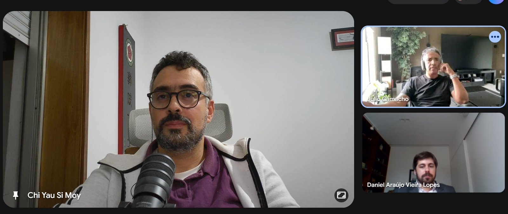

Claudio ficaria com o Siu Nim Tau, como combinado no [XIII Encontro](/notes/xiii-encontro-chines-instrumental/), mas não veio, e Si Fu pediu a Thiago Silva que apresentasse o domínio a Daniel, até para ver como ele vinha apresentando.

Thiago Silva começou pela dificuldade de falar de um domínio separado, sem antes voltar ao que é Kung Fu e ao que é sistema. Usou a imagem da ilha deserta e do livro que se levaria para lá. O Siu Nim Tau é onde se junta tudo o que é essencial do sistema num lugar só. E o essencial é ficar em pé, com bom posicionamento de pernas, coordenando os braços, primeiro de forma unificada, depois simétrica, e então misturando as duas, já antevendo os próximos domínios.

Si Fu cortou ali. Thiago Silva estava falando do Siu Nim Tau como o todo, e o encontro era de cantonês, de cultura e pensamento: a base são a escrita, os fonemas, os ideogramas, e é a partir deles que se vai do chinês para o todo.

Thiago Silva recomeçou pelos três ideogramas. Tau é a parte principal, a mais relevante do sistema, aquela em que se apoiam os outros ensinamentos. Nim traz a ideia: uma ideia do que é principal. E Siu traz o embrionário, como trabalhar essas partes principais para crescer dentro do sistema. Por ser ideia, há coisas pouco explícitas no Siu Nim Tau, como o trabalho de cotovelo ou as energias longas: estão lá, e a pessoa precisa ter um relance para perceber.

Nim Tau também pode ser traduzido como vontade, e Siu como apequenar a vontade. Thiago Silva lembrou de quando, ainda antes do Dou, disse a Si Fu que não tinha mais vontade de fazer nada. A resposta foi que é Siu Nim Tau, não [Mou](/notes/etimologia-de-mou-wu-7121/) Nim Tau 無念頭: tem de haver vontade, só não é para ser muita. Levou uns três anos para entender. Outra leitura do Siu Nim é não tentar saber tanto, esvaziar um pouco a xícara.

### Nim Tau e Ging

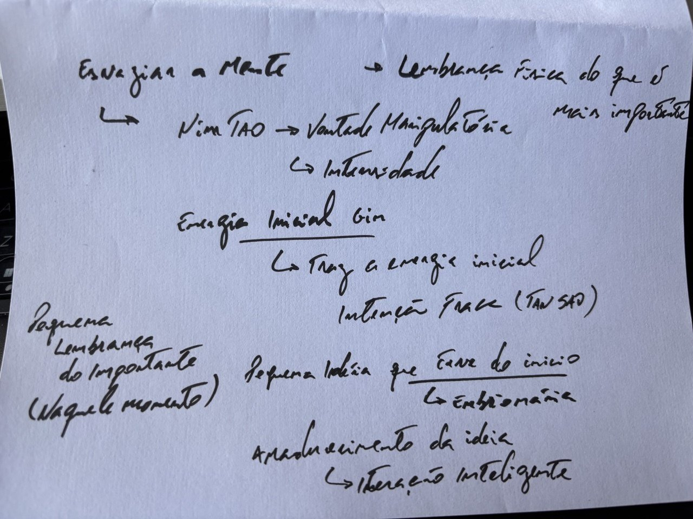

Si Fu aproveitou a apresentação para arrumar e complementar. Na ideia de apequenar ou tornar insignificante o Nim Tau, é preciso cuidado para não cair na estereotipia. Há uma influência do budismo, pelo menos como ele chega ao Ocidente, com a ideia de esvaziar a mente, como se ter conteúdo na mente fosse ruim. Não é.

O Nim Tau pode ser traduzido como vontade manipulatória, aquela vontade que passa do ponto. Mas o que a torna manipulatória é a quantidade, e não a qualidade: é quando se nota que está forçando. Si Fu deu o exemplo de Daniel propondo começar o encontro às 16h10 em vez de às 16h, sem encaixe, forçado para os outros, e insistindo, insistindo.

O Siu, portanto, não transforma o Nim Tau numa coisa negativa. O Nim Tau só fica negativo pela intensidade, pela frequência ou pela quantidade. Não se trata de zerar o Nim Tau. Ele é componente, senão nem haveria o nome.

Si Taai Gung Moy Yat fala de uma energia chamada [Ging 勁](/notes/etimologia-de-ging-jing-52c1/), um tipo de vontade. Thiago Silva mandou o ideograma no grupo durante a aula, e Si Fu confirmou: é aquele com a aguinha e a força.

Para explicar, Si Fu perguntou se carro ainda tem motor de arranque. O motor de arranque é um motor auxiliar, muitas vezes elétrico, só para dar a partida. É uma faísca que desperta o motor principal e desliga em seguida. Se não desliga, dá problema no carro. O melhor exemplo é o isqueiro: a chamazinha pequena faz o fogo pegar, e depois se solta. Quem fica segurando queima o dedo.

O Ging é essa energia. Um Nim Tau ajustado, na medida justa, é o que equivale ao Ging. Si Fu costuma traduzir Ging por **intenção fraca**, aquela que só dá direção.

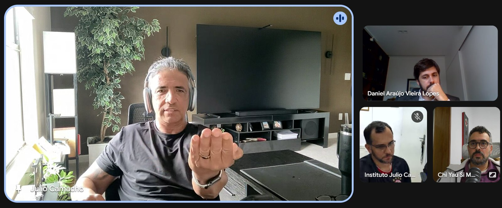

O Tan Sao é o melhor exemplo. Prepara-se a posição, e ele já está apontado: o ombro posicionado, o cotovelo baixo, a energia fluindo. O avanço do Tan Sao é consequência, desdobramento disso. Se a mão fica fechada, ele não sai; se a mão não é apertada antes, não há energia acumulada para sair. O Ging são esses pequenos comandos que fazem a coisa acontecer por ela própria, e o Siu Nim Tau é o movimento de trazer o Nim Tau para esse status de Ging.

Quando se diz Siu Nim Tau, é porque o Nim Tau passou do ponto e precisa do Siu. Ainda assim, o Nim Tau não é pernóstico nem negativo em si.

> [!NOTE] Pesquisa posterior
> A nota de etimologia de 勁 registra a composição de 力 (força) com 巠, componente fonético que o Shuowen associa aos fios da urdidura do tear. A "aguinha" vista em aula é a semelhança gráfica dos traços de 巠. Ver [Etimologia de 勁](/notes/etimologia-de-ging-jing-52c1/).

### As combinações dos três sentidos

Si Fu retomou o que ficou do encontro anterior: [Siu](/notes/siu-pequeno-embrionario-insignificante/) pode ser pequeno, embrionário ou insignificante; [Nim](/notes/nim-ideia-pensamento-lembranca/) pode ser ideia, pensamento ou lembrança; [Tau](/notes/tau-cabeca-inicio-guarda/) se encontra em geral como cabeça, mas o que importa ali é o sentido de mais importante, e o terceiro é início. Ele gosta de dar três porque cerca bem as possibilidades.

Início é o sentido mais estendido, porque é como se tudo começasse pelo mais importante, pela cabeça. Quando se diz a um chinês clássico que o Siu Nim Tau, a primeira sequência, é a mais importante, ele responde: sei, ouvi dizer que a chuva também molha. Normalmente se começa pelo mais importante. Nos filmes antigos o protagonista era apresentado logo; hoje se joga mais para a frente, mas um filme ou livro sobre fulano costuma começar por fulano.

O termo que tinha faltado no encontro anterior era permutação, e Si Fu esclareceu que nem é preciso permutar nada: trata-se de jogar com as combinações possíveis, nos três tempos (passado, presente e futuro) a partir dos quais se chega ao Siu Nim Tau.

A tradução mais usual é pequena ideia inicial. Não é pequena ideia do caminho, porque em cantonês Tau não é caminho: caminho é [Dou 道](/notes/etimologia-de-dou-dao-9053/). Mas, como interpretação, pequena ideia do caminho funciona, porque o Siu Nim Tau traz pequenas ideias associadas ao caminho do sistema: ficar de frente, chutar, e assim por diante.

Pequena ideia inicial também pode virar pequena ideia do início, e Si Fu perguntou se há diferença. Há. Pequena ideia inicial pode ser uma pequena ideia que se teve no início; pequena ideia do início é uma pequena ideia de como começa. O pequeno aqui não é insignificante: é pequeno relativamente às outras ideias que vão vir. E dá para trazer o embrionário: ideia embrionária do início já muda o sentido.

### Da ideia à interação inteligente

O interessante do termo ideia, retomou Si Fu, é que ele joga para o futuro, que no [encontro anterior](/notes/xiv-encontro-chines-instrumental/) ficou atrás e não à frente. Diz respeito ao que ainda não se viu, que se imagina e não se lembra. Pequena ideia inicial é muito bom para começar.

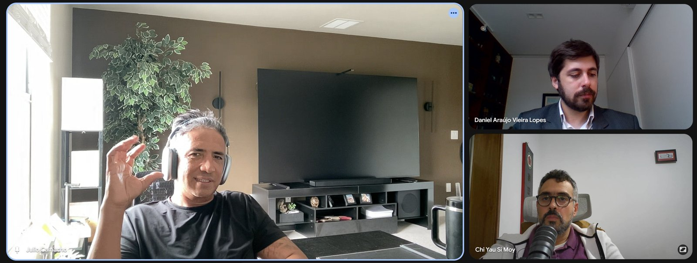

Depois, quando o Siu Nim Tau já é praticado, e a pessoa já está no Cham Kiu, no Biu Ji ou no Jong mas mantém um trato com a sequência, aparece o embrionário. No começo, quase é preciso acreditar que aquilo é embrião de algo. No Cham Kiu, a pessoa vê que um gesto é igual a outro do Siu Nim Tau, só que agora puxa os dois, ou agora vira. Entre centenas de casos, ela começa a pensar: espera um pouquinho, aquilo que estava lá atrás está se desenvolvendo, com outras formas, roupagens, expressões, mas com uma essência, e segue pelo Kwan e pelo Dou, que ainda não viu. Fica mais fácil acreditar.

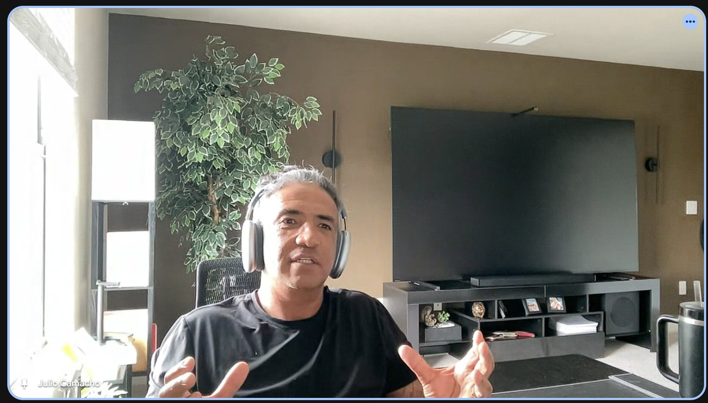

Isso é diferente das imaginações do tipo "o cara segurou meu braço, eu faço assim e já soco a cara dele; vêm dois caras, se um for baixo eu faço o outro; se for anão, eu faço para baixo". Si Fu abriu parênteses para dizer que um praticante é tanto mais maduro quanto menos imaginativo de aplicações ele for, porque aplicação é sempre para o futuro. Dar um Tan Sao na cara, um Bong Sao de dedo aberto para furar o olho, um Fuk Sao que já pega no queixo: é o nível da ideia, do "se isso, então aquilo". Com mais Kung Fu, a coisa vem para o presente. Espera-se acontecer, e atua-se com base no que a situação apresenta, não com base na própria ideia.

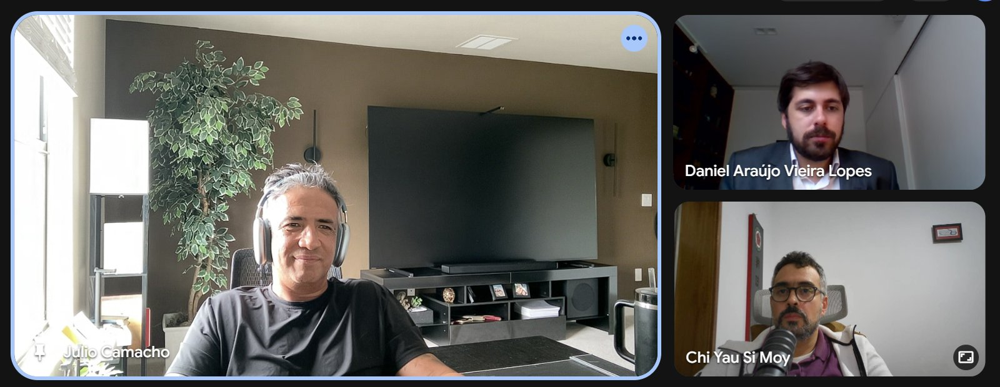

Há então um amadurecimento, da ideia que é para o futuro para algo que a palavra pensamento não traduz bem, uma espécie de conclusão do momento, uma **interação inteligente**.

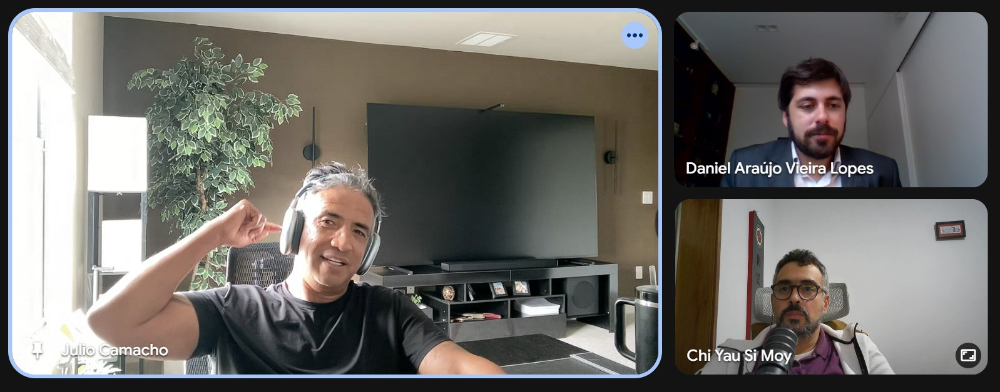

Numa segunda camada, essas conclusões do momento também são embrionárias. Assim como evoluíram de onde vieram, seguem evoluindo. Si Fu lembrou do "I know Kung Fu" de *Matrix*. Nunca vai haver "eu sei Kung Fu". Pode haver "eu sei bastante Kung Fu", "eu sei um absurdo, mais que todo mundo", mas não dá para aprisionar o Kung Fu. É quase como dizer "eu sei viver": não se consegue capturar nem explicar tudo o que é viver, e talvez por isso não se saiba tanto.

### A pequena lembrança do mais importante

Há ainda uma outra perspectiva, a de quando o sistema deixa de ser o instrumento central do desenvolvimento do Kung Fu, etapa que Si Fu situou para Thiago Silva. Completada a jornada do sistema, ele continua sendo usado para seguir se refinando, mas não se depende mais dele. O Siu Nim Tau ganha outra característica. Ainda se sabe que é embrião de algo, mas na experiência particular não se fala de algo que vai se desenvolver no futuro. Volta o sentido mais positivo de pequeno: uma pequena lembrança do que é mais importante.

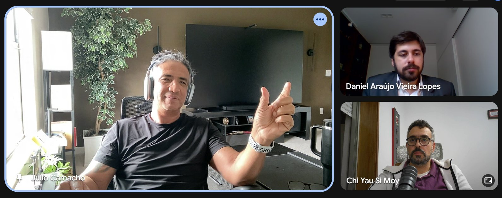

Si Fu lembrou do registro em vídeo que o Patriarca Ip Man deixou aos filhos pouco antes de morrer, em dezembro de 1972 ([Wikipedia, Ip Chun](https://en.wikipedia.org/wiki/Ip_Chun)), com ele já com dor. Si Fu lembrava do Siu Nim Tau, do Cham Kiu e do Biu Ji; a mesma fonte registra no filme o Siu Nim Tau, o Cham Kiu e o Muk Yan Jong. No relato de Si Fu, naquele dia Ip Man teria comentado que a única coisa do Kung Fu que ainda praticava era o Siu Nim Tau. Si Fu já ouviu outra versão, a de que praticava as duas pontas, mas a que ouviu mais de uma vez, e que faz mais sentido para ele, é a do Siu Nim Tau só.

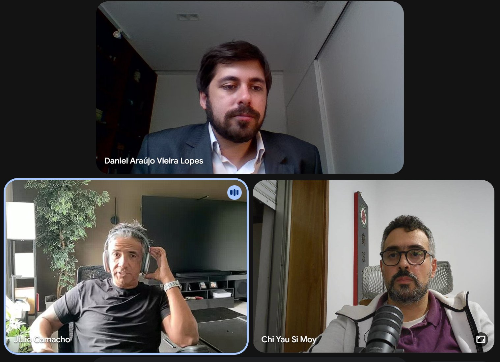

E compartilhou um hábito próprio. De manhã cedo, gosta de fazer Siu Nim Tau, até hoje. Já variou e não foi todos os dias da vida, mas, numa semana de sete dias, em uns cinco tende a ser a primeira atividade depois da higiene, e quando não acontece de manhã, eventualmente faz à noite. Faz bem diferente do que transmite: às vezes a mão mais frouxa, a base mais largada, um processo muito mais meditativo, normalmente longo. Não é para Daniel ou Thiago Silva melhorarem o próprio Kung Fu. Se um dia Si Fu morrer e eles estiverem vivos, podem contar, porque é real, tão anedótico quanto o de Si Jo Ip Man.

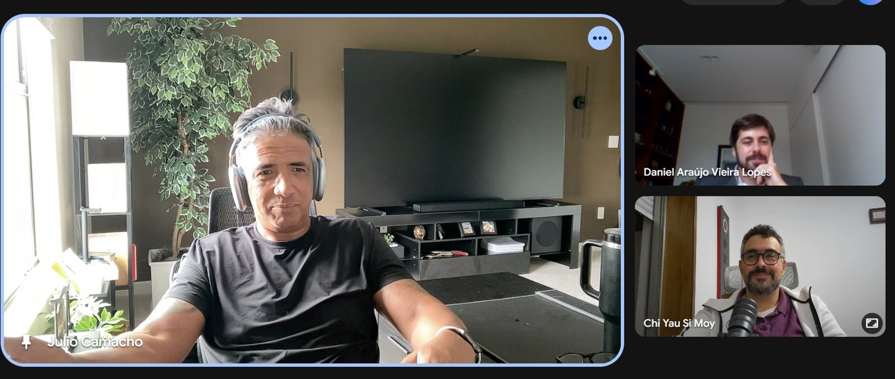

Nessa etapa, a pequena lembrança é física, não mental, do que é mais importante. Por isso Si Fu faz diferente do que transmite: é uma lembrança pequena, no sentido positivo; lembrança porque olha para o passado; e Tau no sentido do mais importante, para ele, naquele momento.

O momento não congela em "agora sou novato, agora passei, agora completei esse tema". Ele se dá de forma inextensa, sem extensão, [como no encontro anterior](/notes/xiv-encontro-chines-instrumental/). O mais importante é o daquela manhã, do jeito que ele está. O momento de quem completou o sistema há um bom tempo e tem um trato íntimo com ele inclui dias de acordar mais descansado, mais energético, mais tenso, mais relaxado, mais ansioso, com fome, sem fome, com frio, com calor. O Siu Nim Tau dele é mediado por isso, e Si Fu se corrigiu: mediado, não regulado.

### Uma ideia só vale quando gera outras

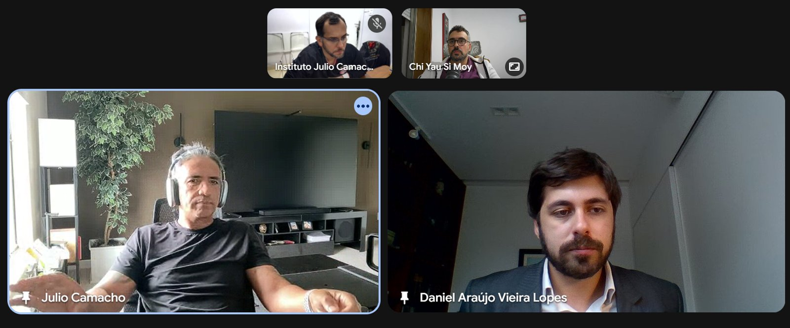

Daniel achou o encontro uma continuação do anterior. Não tinha associado os movimentos iniciais do Siu Nim Tau ao desenvolvimento até o Biu Ji, e esse insight não tinha passado por ele. Viu também a camada da sugestão de rotina que já tinha recebido e vinha adotando quando podia. Às vezes fazia só o Siu Nim Tau e se perguntava por que não fazer o Biu Ji também. Para Si Fu, no ultrafinal do sistema, faz sentido ter só o Siu Nim Tau como pequena lembrança; para Daniel, no momento intermediário, faz sentido começar pelo Biu Ji, por exemplo. Claro, respondeu Si Fu.

Si Fu elogiou que Daniel trouxesse a sugestão para o aspecto pessoal, exatamente por essa razão, mas apontou o que importa mais: uma fala, um pensamento, uma ideia só tem valor de fato quando gera outras falas, outros pensamentos e outras ideias. Quem repete canonicamente o que ouviu desvaloriza o que foi dito, salvo quando o pedido é justamente repetir, como num recado.

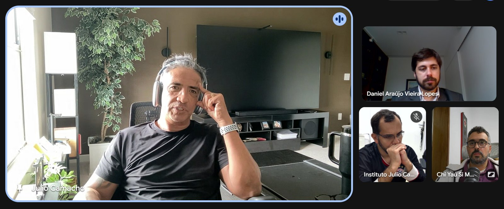

O exemplo foi a fórmula matemática. Se o sinal de mais só for usado para dois mais dois, basta decorar o resultado. A fórmula só tem sentido com três mais cinco, dezoito mais cinquenta e três, e assim por diante. Uma fala, uma dica, uma sugestão ganha valor quando é adaptada às circunstâncias. Por isso o copiador, que repete, dá o mesmo exemplo e conta a mesma piada, tem tão pouco valor: não que não tenha valor em si, mas não está valorizando. O outro extremo é fazer dois mais dois dar zero, que é subversão, e não é o que se quer. Respeita-se a essência do que foi dito, sobretudo quando se fala em nome de outro, e transforma-se. A dica de Si Fu não é para fazer igual a ele, e sim para pensar como atender ao que foi pedido com base na própria realidade, vontade, capacidade, Kung Fu e inteligência.

### Comunicar no lugar de falar

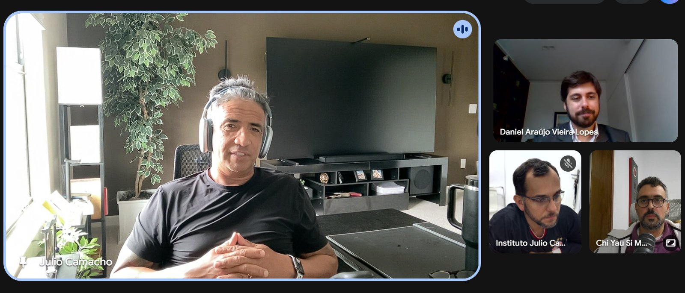

Thiago Silva gostou dos ajustes e adiantou a Guilherme que ia lançar a proposta no grupo do Programa de Mestrado, onde estão as pessoas que naturalmente deveriam participar. Sobre o Siu Nim Tau, falou para Daniel de uma fase que pegou: quando Si Fu foi se titular, pouco depois de Thiago Silva começar a treinar, Si Gung batia muito na tecla de não falar. A sensação dele é que isso ficou na cabeça de todo mundo e não se atualizou.

Para ele, o papel do Si Hing muitas vezes é soltar essas coisinhas, sem peso. Quando alguém diz "nunca pensei nisso", a pessoa já deveria ter pensado há muito tempo, porque alguém no Mo Gun poderia ter dito, e ninguém disse. Thiago Silva vê uma espécie de fetichização do "eu não posso falar", e a compara com a transição em que Si Gung avisava a um novo Si Fu para tomar cuidado com o que falasse, porque o To Dai escreveria na pedra e nunca mais tiraria. O conhecimento parou de fluir em algum momento. Ele próprio fala demais: não tem certeza de nada, mas, como Si Hing, pode falar, e depois a pessoa confere com o Si Fu. Toda vez que acompanha alguém entrando num domínio, faz questão de que todos os presentes digam o que veem de Cham Kiu, porque senão fica só o que o tutor falou, e os tutores também não falam mais. Mesmo que seja errado, a pessoa um dia percebe e refaz o conhecimento, e o introjeta, como no Siu Nim Tau que Si Fu descreveu.

Com Guilherme, Thiago Silva vem gravando às quintas à noite um minipodcast de uns cinco minutos sobre alguns temas. Já gravaram o Siu Nim Tau, e o próximo é o Cham Kiu. O que apresentou naquele dia veio da gravação da quinta anterior, e Si Fu brincou que deu para ver que estava preparado. Thiago Silva respondeu que ficou no improviso, mas que também é treino de falar.

Si Fu trocou a palavra falar por comunicar. A comunicação verbal é importante, a corporal também, a silenciosa também: quando ele faz uma pergunta e fica o silêncio, o constrangimento comunica alguma coisa. O conhecimento tem de fluir, para produzir mais conhecimento.

Aquele momento do Si Gung, para Si Fu, era atravessado pela circunstância da família na época, muito imatura. E quanto mais imaturo, mais verdade se busca. Quem entra no Mo Gun quer a verdade. Depois de um tempo, acha que vai ser difícil, que não vai chegar nela. Depois, que também não há uma verdade. Até ter certeza de que o conceito de verdade, assim entendido, é quase infantil. É verdade que estavam ali naquele dia, mas se cada um definir o que aconteceu, vão sair coisas muito diferentes.

Contra a frase do senso comum de que contra fatos não há argumentos, Si Fu prefere dizer que **fatos são argumentos**. Não há fato sem interpretação; quem narra está argumentando sobre algo que testemunhou ou acredita que aconteceu.

Naquele ponto lá atrás, com alunos e tutores novatos, o próprio transmissor apostava numa verdade e a defendia com unhas e dentes. O errado não era o conteúdo, era a ideia de verdade. Dizer que o Tan Sao tende à linha central não está errado. Mas não é verdade canônica: quando o Tan Sao deriva do Fuk Sao no [Jip Sao](/notes/etimologia-de-jip-jie-63a5/), ele não tende à linha central, já está nela. Tudo o que faz muito sentido tem aberturas, e o sistema mostra isso.

Se uma única pessoa fala muito e acredita muito no que fala, o conselho de Si Gung vale: fale menos, porque vai contaminar o outro. Mas quando várias pessoas falam coisas diferentes, sem se colocar como donas da verdade, o que se gera na cabeça de quem ouve é a percepção de que as falas se complementam, e de que talvez haja mais coisas, que um dia ele próprio pode dizer. Abre-se uma perspectiva artística do processo, de criação.

Criar não é inventar do zero. Quem pinta um quadro original usa pincel e tinta que outros inventaram. É o que se diz da IA, que junta milhões de imagens para fazer uma, e Si Fu frisou que ali não era um discurso político sobre isso. Nenhuma das palavras que ele estava usando foi inventada por ele, nem mesmo neologismo. Daí o recado a Daniel, de nunca dizer "fale com as suas palavras". As palavras são do idioma; com palavras só suas, ninguém entende, porque não se compartilha o código. Pior ainda, "com as suas próprias palavras".

A comunicação está na fala, no texto, no movimento, na circunstância, na proposição. Uma pessoa só, numa posição importante, dá às coisas um cunho de verdade oficial. Várias pessoas, com falas que às vezes se confrontam mas normalmente colaboram, abrem um processo muito mais rico de formação de conhecimento.

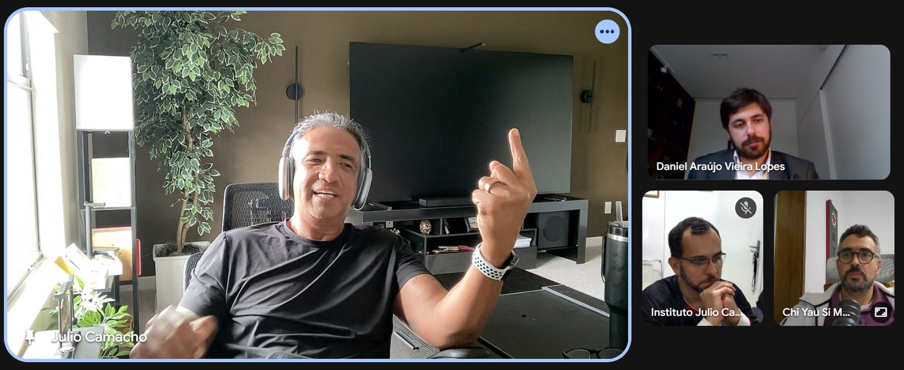

Era para acabar às 17h, e faltavam alguns segundos. Si Fu pediu que conversassem entre si para levar o processo adiante, e deixou para a semana seguinte que Guilherme e Daniel publicassem alguma coisa.
