Anotações do décimo sexto encontro, o primeiro com o novo nome da série, Idioma, Cultura e Pensamento Chinês para o Kung Fu (antes Chinês Instrumental), conduzido por [Si Fu](/notes/os-dois-si-fu/), o primeiro no horário de quarta às 19h do Brasil combinado no [XV Encontro](/notes/xv-encontro-chines-instrumental/). [Daniel Araújo](/notes/moy-tang-yok/) e [Guilherme Farias](/notes/moy-faat-lin/) participaram do Mo Gun, na mesma câmera, Thiago Silva de Portugal, e o Si Suk Homero Pereira entrou como convidado. O tema foi sistema: os três termos que um chinês daria para traduzir a palavra, o que cada um abrange e o que fica de fora.

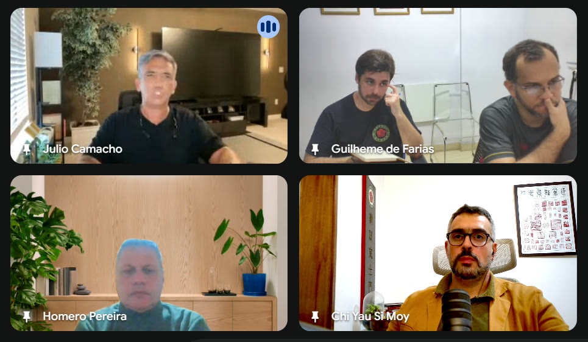

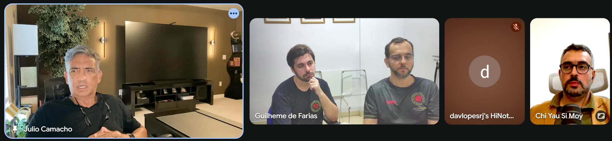

### Um convidado e o formato aberto

Antes de começar, Si Fu reparou num participante a mais na chamada, o caderno digital de Daniel, que entra sozinho quando a reunião começa e transcreve tudo. Daniel garantiu que não estava hackeando ninguém nem venderia o material para a concorrência, e que o caderno respeita a Lei Geral de Proteção de Dados. Si Fu respondeu que estava falando de coisa pior, de o caderno um dia matar o dono, e recomendou tratá-lo bem.

Si Fu apresentou o Si Suk Homero Pereira a Daniel. Homero praticou junto com ele desde 1993, quando Daniel, nascido em 2000, ainda nem existia. É um grande amigo, fizeram muita coisa juntos, dirigiu núcleos no Rio e hoje mora no Rio Grande do Sul. Os dois estão num grupo com outros mestres, e Si Fu o convidou mais cedo naquele dia, deixando o encontro aberto para ele voltar quando quisesse.

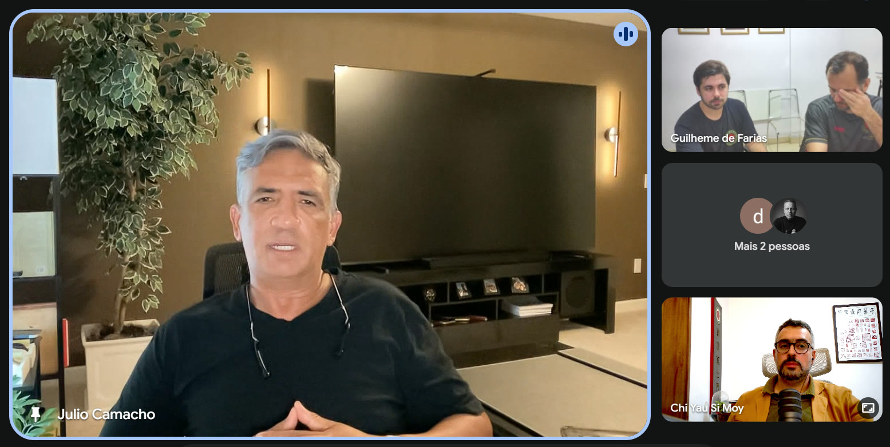

Para situar Homero, Si Fu resumiu a história da série. Começou como proposta de Claudio, baseada no cantonês, com aulas diretas para Claudio e Thiago Silva, usando o idioma para entender instrumentalmente o Ving Tsun. Com tanto aspecto de cultura e de pensamento envolvido, pareceu valer mais partir do todo para a parte: aspectos gerais, instrumentalizados pelo sistema e pela linguagem da família, abrindo mais para conceito. O foco continua nos ideogramas, sobretudo nas pronúncias e nos tons do cantonês e do mandarim.

Daniel e Guilherme tinham pensado em voltar aos ideogramas do ensino. Si Fu lembrou que isso já foi trabalhado com o primeiro grupo e de novo quando Daniel entrou, e que pode voltar num ciclo futuro. Preferiu começar um ponto antes, por sistema e estilo, assunto que ainda não tinha levado ao grupo.

### Kuen Paai 拳派

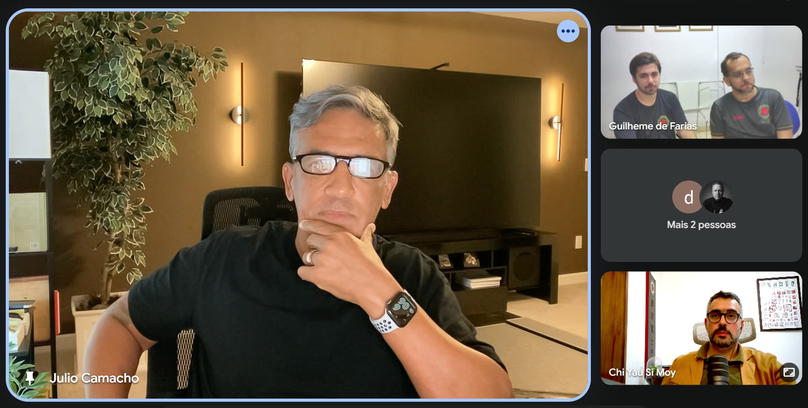

Si Fu abriu com uma pergunta: quando se fala em sistema de Kung Fu, em termos gerais e não da família, o que se quer dizer? Guilherme começou pela lógica do Hai Tong, um sistema de listas, e Si Fu o parou ali mesmo, porque era exatamente onde não queria entrar ainda.

Si Fu já fez essa pergunta à sua professora de chinês da época da PUC: como se traduz sistema? Um chinês dá três respostas, e a primeira é [Kuen](/notes/etimologia-de-kuen-quan/) [Paai](/notes/etimologia-de-paai-pai-6d3e/) 拳派. Kuen é punho, e o Paai é o mesmo de Mun Paai. Thiago Silva levantou os ideogramas e os mandou no grupo durante a aula.

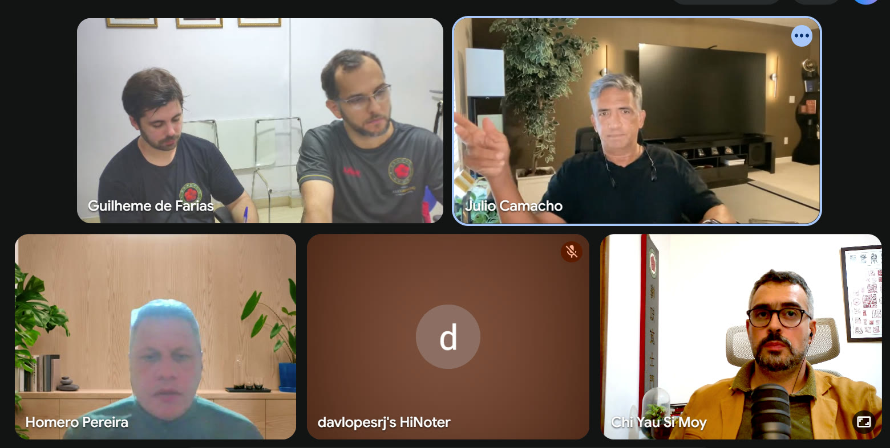

Antes de seguir, Si Fu deu um ponto de pronúncia para gravar como regra. Na conta dele, o mandarim tem quatro tons e um neutro, e no cantonês uns contam sete, outros oito, outros nove, sem uma configuração fechada. Em ambos, o quarto tom é corte rápido, e Si Fu marcou com um gesto de cortar.

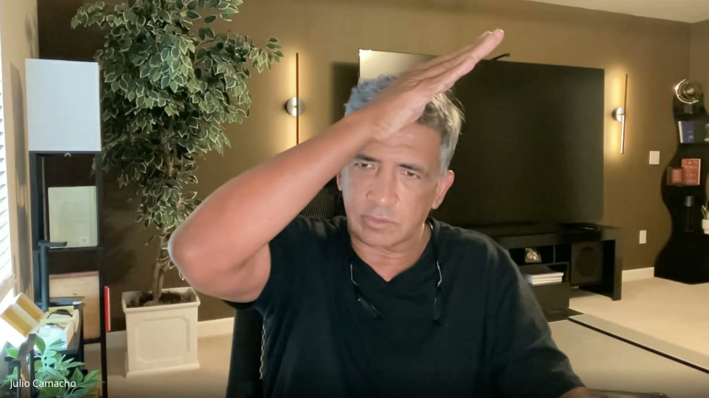

O Kuen de Kuen Paai é quarto tom, cortado, sem prolongamento. O Paai faz algo como o terceiro tom do mandarim, que é um vezinho: desce e sobe. Em cantonês, mal comparando, seria mais redondo, mais esticado, e no mandarim a ponta fica mais clara. Si Fu ressalvou que só estava jogando o fonema no terceiro tom do mandarim, sem dizer que a palavra se pronuncia assim em mandarim.

Kuen Paai é o que o chinês comum traduz por sistema. Sendo Kuen o punho, Kuen Paai é a maneira como se luta. Uma coisa é o que o idioma propõe, outra é o que a família convencionou. A família faz uma diferença hierárquica entre estilo e sistema, como se o sistema estivesse num ponto acima do estilo, e isso, para o chinês, de modo geral não faz sentido.

Essa preocupação com a ortodoxia da organização é mais japonesa do que chinesa. A lógica chinesa, como a comida chinesa, é mais solta. O saber da família veio do Si Gung Leo Imamura, que tem uma escola pessoal muito japonesa, muito organizada, e daí a sobrevalência do sistema sobre o estilo na cultura interna da família. Um chinês não se ofende se alguém disser estilo Ving Tsun.

### O sistema é o duto, o Kung Fu é a resultante

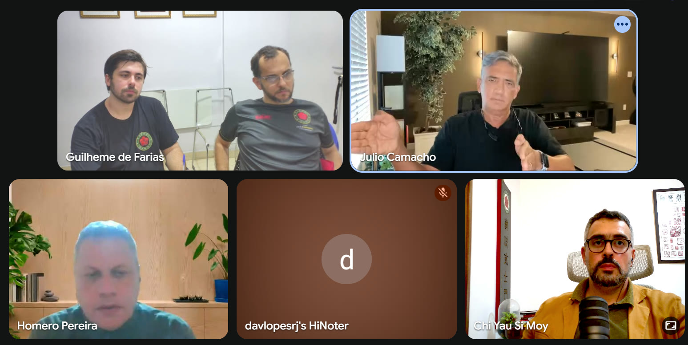

Homero perguntou se Kuen Paai seria, dentro do meio, o equivalente ao que o ocidental chama genericamente de Kung Fu. Si Fu voltou um passo para deixar a coisa linear. Se se diz Ving Tsun Kung Fu, Ving Tsun e Kung Fu são coisas diferentes. Ving Tsun é o Kuen Paai; Kung Fu é o Kung Fu. Daria para perguntar a alguém qual é o Kuen Paai do seu Kung Fu, e a resposta seria Ving Tsun.

Grosso modo, Kung Fu é o resultado, e o sistema é o mecanismo, o duto para chegar a ele. Por extensão, diz-se que é preciso ter Kung Fu para desenvolver Kung Fu, mas isso já é extensão. A rigor, sistema é o duto por meio do qual se desenvolve Kung Fu. Tanto que existe Ving Tsun Kung Fu, Tai Chi Kung Fu, Hung Gar Kung Fu: vários dutos chegando ao Kung Fu.

Homero resumiu que o Kung Fu seria o produto final adquirido depois de atravessar o duto, e que o duto não é Kung Fu. Si Fu concordou, com dois ajustes. Para transitar no duto já é preciso algum Kung Fu, e quanto mais Kung Fu, melhor se transita. E não diria produto final, porque não há final: é produto, resultado, **resultante**.

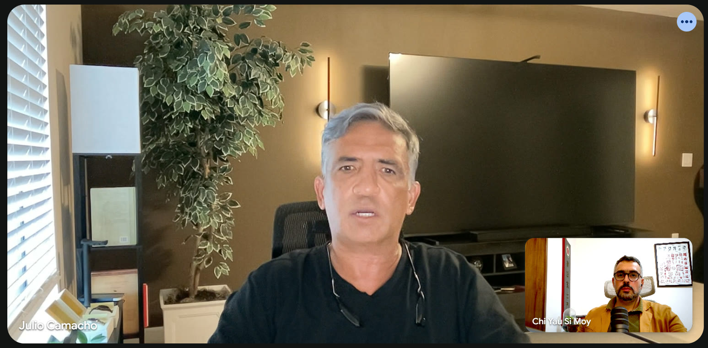

O que se transmite é o sistema, e o Kung Fu fica de fora da transmissão. O que se entrega são os pedacinhos, os anéis desse duto, para o outro ir montando. Ou, se fosse uma ponte, as pecinhas para ele montar a pontezinha dele.

Isso explica falar de Kung Fu na cozinha, porque o duto ali é outro. Os dutos marciais, todos, são chamados de Kuen Paai, e é o que se traduz por estilo. E essa extensão para a vida, a ideia de vida Kung Fu, não se aplica dentro de Kuen Paai, que tem a ver diretamente com a expressão da luta.

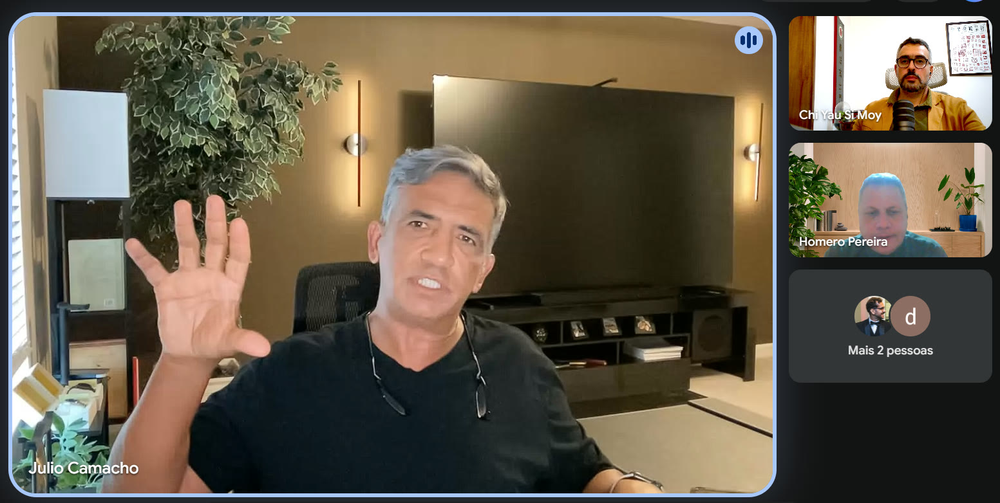

Kuen é punho, ou o soco, o próprio ato. Paai, grosso modo, é escola, uma corrente. Si Fu chegou a dizer que Paai tinha a ver com fio de seda e pediu a Thiago Silva que conferisse, mas se corrigiu na mesma hora: estava confundindo com o Tong de Hai Tong, que viria depois. Paai é ramo, ramificação, e Kuen Paai é uma determinada escola daquele tipo de Kuen.

> [!NOTE] Pesquisa posterior
> A nota de etimologia de [派](/notes/etimologia-de-paai-pai-6d3e/) registra no Shuowen 別水也, a água que se ramifica: o ramo é de rio, não de árvore, mas o sentido de ramificação se mantém. O fio de seda está em [統](/notes/etimologia-de-tong-tong-7d71/), como Si Fu se corrigiu em aula.

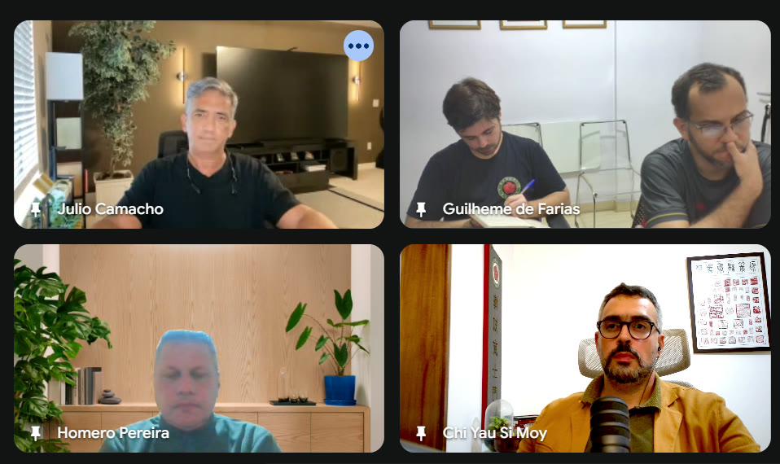

### Mun Paai 門派

A segunda maneira de traduzir sistema, por incrível que pareça, é Mun Paai 門派, que a família traduz por família. Se alguém disser a um chinês Ving Tsun Mun Paai, ele entende tranquilamente. Os tons são os mesmos de Kuen Paai: quarto e terceiro.

[Mun 門](/notes/etimologia-de-mun-men-9580/) é porta, porta mesmo, física, a entrada. Em mandarim, *mén*. Si Fu lembrou do 天安門 *Tiān'ānmén*, o grande portão da Praça da Paz Celestial. Por extensão, Mun é a casa, no sentido de cultura da casa. Guilherme sugeriu família, e Si Fu concordou só em parte: a rigor não é família, mas no sentido em que se fala de família Kung Fu funciona, porque não se fala só das relações, e sim de uma cultura que existe dentro daquela casa.

Homero perguntou se o ideograma era o mesmo de Ip Man. É parecido, tem a mesma raiz: o [問](/notes/etimologia-de-man-wen/) de [葉](/notes/etimologia-de-ip-ye-8449/)問 tem uma boca debaixo da porta, e é a única diferença.

Mun Paai é estilo no sentido mais amplo. As relações familiares, as tradições, o estilo de transmissão, tudo está dentro do Mun Paai, e faz sentido dizer o Mun Paai de que se participa. Mas, conversando com um chinês, ele pode perguntar qual é o Mun Paai, e a resposta pode ser Ving Tsun, sem precisar falar de Moy Jo Lei Ou ou Moy Yat Sang. É preciso entender o contexto da pergunta, que não é tão objetiva.

Outro detalhe: quando o duto não é marcial, não se usa Kuen Paai, e sim Mun Paai. Na culinária, na música, se aquilo for considerado Kung Fu, o que é raro, os estilos ali dentro são Mun Paai. Arco e flecha já fica dentro da marcialidade. Um é mais específico, da marcialidade; o outro, mais geral.

### Hai Tong 系統

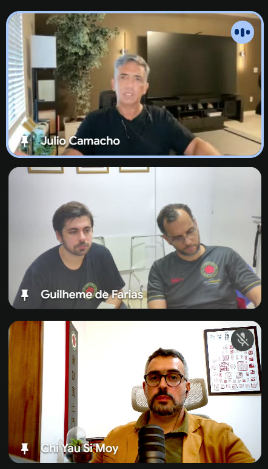

O terceiro termo é Hai Tong 系統, e por isso, quando Guilherme falou de listas, Si Fu pediu mais cuidado. Hai é sexto tom, e Tong, segundo. Para o sexto, Si Fu pediu que se pensasse no oposto do terceiro tom do mandarim, a voltinha de cima e não a de baixo, ressalvando que essa grafia não existe e que falava só pelo fonema. O tom morre, quase como o tom neutro do mandarim: *Hai, Hai Tong*.

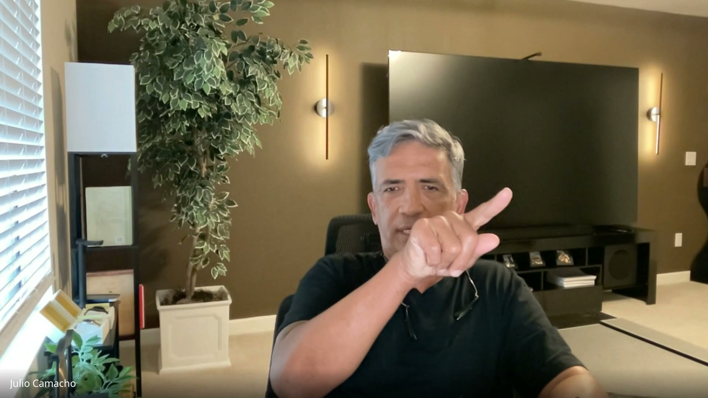

[Hai](/notes/etimologia-de-hai-xi-7e6b/) é conectar, ligar. É fio, conexão, pode ser linha e pode ser relação. [Tong](/notes/etimologia-de-tong-tong-7d71/) é organizar. Si Fu não lembrava de cabeça o ideograma de Tong, achava que tinha relação com governar, unificar, organizar a sociedade, e pediu a Thiago Silva que pesquisasse a etimologia.

Homero perguntou se esse Tong seria o mesmo de câmara. Com certeza não: aquele é de cômodo, um local. Este é um verbo, associado a reunir, organizar, concatenar.

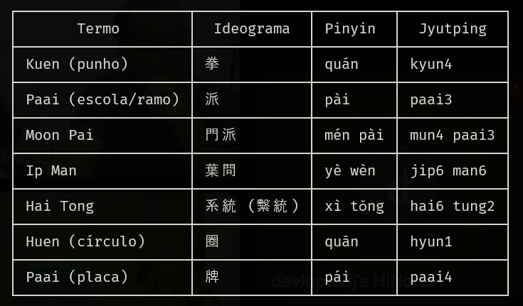

Hai Tong é organizar, conectar as transmissões de uma linhagem, de uma linha. Há outra leitura possível: organizar como uma linha os componentes daquele Kuen Paai, numa coisa linear. É isso que o Si Gung chama de sistema chinês.

Sistema chinês, porém, é um termo que circula dentro da família do Si Gung, não amplamente. Falar de sistema chinês para um chinês é como pedir whisky escocês na Escócia. Si Fu abriu um parêntese: nos Estados Unidos fala-se em ir comer comida brasileira, mas ninguém diz que vai comer comida americana, só come a porcaria que tem. Porcaria mesmo, e ele está mais magro e mais saudável graças a isso, porque lá o ruim é tão descarado que se acaba comendo bem. No Brasil, o ruim é disfarçado.

> [!NOTE] Pesquisa posterior
> A nota de etimologia de [統](/notes/etimologia-de-tong-tong-7d71/) confirma a desconfiança de Si Fu: o caractere nomeia originalmente o fio-mestre puxado do casulo da seda, daí ramo principal, linhagem e governar. [繫/系](/notes/etimologia-de-hai-xi-7e6b/) é atar, ligar. Ver também [系統 Hai Tong](/notes/hai-tong-systems-thinking/).

### Perguntar pela linhagem

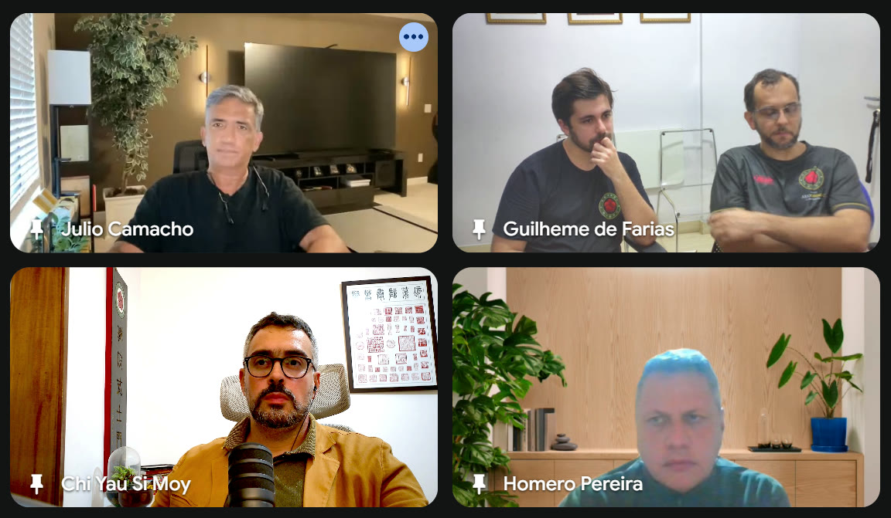

Se alguém pergunta em chinês qual é o seu Hai, a pergunta é sobre a relação que se tem com aquela pessoa. E aí entrou um detalhe de etiqueta: não se pergunta quem é o Si Fu de alguém. Pergunta-se qual é a linhagem, porque senão o Si Fu fica destacado da linhagem.

A pergunta pela linhagem deixa a pessoa marcar onde quiser: minha linhagem é Ip Man, minha linhagem é Moy Yat. Na China há vários Ip Man Ving Tsun e vários que não são. Dizer só Ip Man Ving Tsun, quando todo mundo quer ser Ip Man Ving Tsun, não diz nada; citar um nome que ninguém ali conhece também não adianta. Às vezes é preciso se colocar, dentro dos alunos de Ip Man, na linhagem Moy Yat.

Si Fu retomou um exemplo que deu no início da série, quando Daniel ainda não estava. Perguntou a Daniel qual convite era mais gentil: "Daniel, você quer jantar comigo?" ou "Daniel, eu vou jantar, você vai ou não vai?". Daniel escolheu o primeiro. Para o chinês, é muito pouco polido, porque entrega a possibilidade de um sim ou de um não, de aceitar ou de negar o pedido. No segundo, quem convida se posiciona e oferece duas alternativas de aceitar, sem que o outro precise negar nada. Daniel acrescentou que assim também não passa a mensagem de que não se quer jantar com ele.

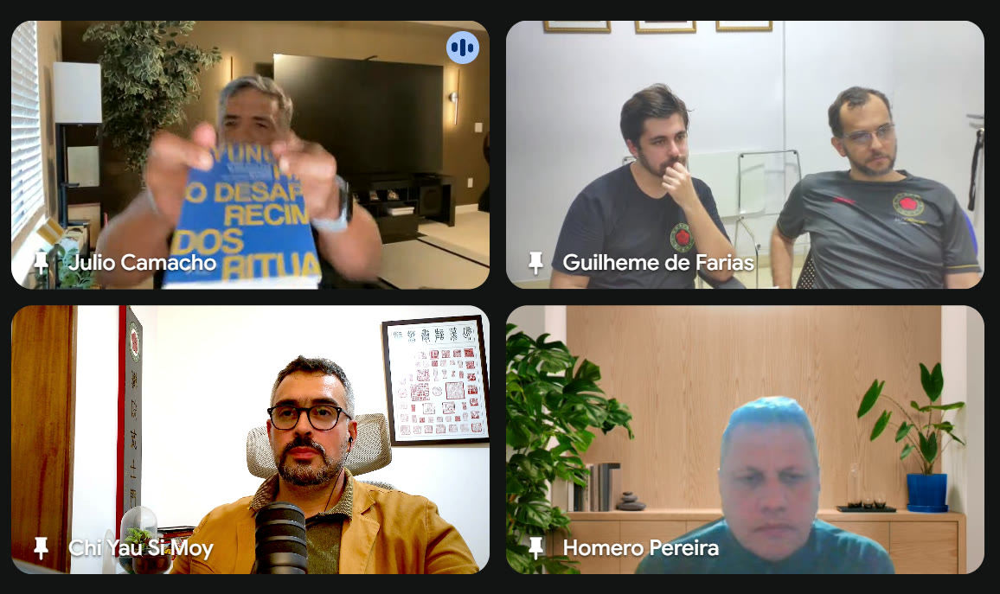

É do pensamento chinês sempre entregar desse jeito. Um livro se entrega de frente, um cartão se entrega virado para o outro ler o nome, nunca de lado, para ele não correr o risco de não lembrar de quem o deu. A pergunta se faz para não constranger a possibilidade da resposta. Se alguém pergunta a Guilherme, na China, quem é o Si Fu dele, e ouve Julio Camacho, só pode responder que não conhece, e ninguém tem obrigação de conhecer todo mundo. É preciso ter Kung Fu, no sentido de resultante, para escolher a resposta que faz a conversa fluir.

Numa conversa mais formal, e no Kung Fu elas são comuns, cabe perguntar qual é o seu Hai Tong. Informalmente, não precisa: no meio do treino, todo suado, depois de um Lat Sao com alguém muito bom, aquela paradinha para respirar, a pergunta pela linhagem é um elogio, e basta perguntar qual é o seu Hai. Daria até para perguntar qual é o seu Mun Paai, mas é mais raro.

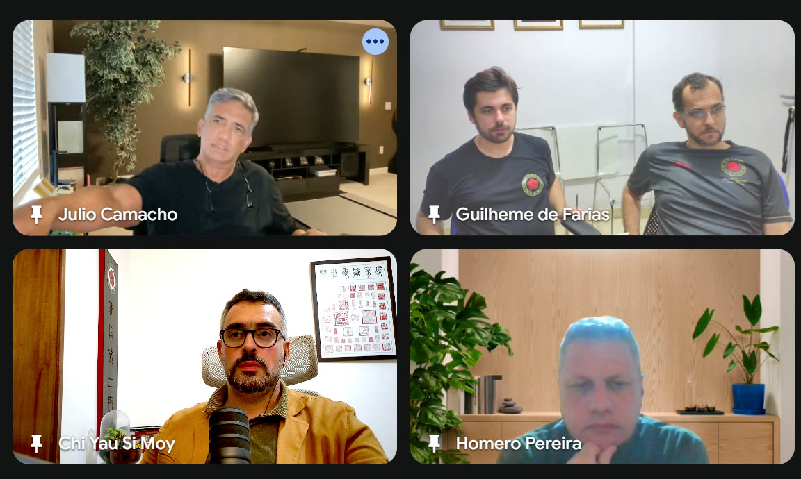

### Em um Hai Tong 系統, a ordem é componente

Hai é a linha que conecta; Tong é organizar, concatenar, juntar as coisas. No sistema Ving Tsun propriamente dito, pode-se chamar de Hai Tong a organização dos componentes, e como Hai tem a ver com linha, é uma organização linear. Guilherme quis voltar à lista, e Si Fu segurou: ainda não.

Num Hai Tong, a ordem dos elementos é componente dele. Si Fu deu o exemplo do bolo, ressalvando que não é muito bom de cozinha. Quebrar o ovo e depois pôr a farinha, ou o contrário, em tese dá na mesma. Isso é um sistema, mas não é linear, e definitivamente não é Hai Tong. No Hai Tong há um fio todo emendado, e a ordem com que os elementos são apresentados faz parte dele. Trocar a ordem dá outro Hai Tong.

Si Fu ressalvou que isso não é tão rigoroso assim: falar de cultura chinesa é falar de quatro ou cinco mil anos e de muitos momentos diferentes, e seria ilusão tentar uma regra única valendo para todo mundo. Há momentos em que o Kung Fu foi muito difundido, praticado e aceito, e momentos em que se retraiu, como na Revolução. Quando volta depois de represado, sai como água desgovernada.

Para Si Fu, a explosão de mestres chineses indo para Hong Kong na década de 1950 foi da ordem do caótico. Si Fu esteve na China em 2006, 2009 e 2012, e numa dessas voltas, talvez a de 2006, conversou sobre isso. Os locais de Kung Fu que visitou iam de um bairro caríssimo de Hong Kong, que comparou ao Leblon, até a região da Nathan Road, na época algo como a Baixada Fluminense, longe e até perigosa: quem morava num lugar não ia ao outro.

O Kung Fu se popularizou e também se bagunçou. Alguns rigores de refinamento, de linguagem e de pensamento se perderam. Si Fu, que está estudando latim, comparou ao latim vulgar, do contato dos soldados com a população, que não é o latim dos palácios: a língua do palácio não é a língua do povo. Havia um requinte, em várias camadas, na linguagem do Kung Fu, e ele se perde nessas explosões demográficas, como na Hong Kong dos anos 1950, com muita gente chegando e se dizendo de Kung Fu sem ser, e de novo nos anos 1970, com Bruce Lee.

### A lista e o Ving Tsun puro

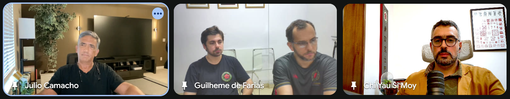

A ideia de lista, que Guilherme trouxe, tem mais a ver com a perspectiva do Si Taai Gung Moy Yat, a partir da experiência que teve com o Patriarca Ip Man, de não interferir no sistema e entregar o mínimo suficiente para ele se manter de pé. A sequência Tan Sao, Huen Sao, Fuk Sao é uma lista, e a ordem é componente dela. Tan Sao, Fuk Sao, Huen Sao já é outra sequência. Si Fu se corrigiu em seguida: isso seria uma sequência, e Hai Tong é o todo.

O termo listagem é de François Jullien, quem o introduziu no vocabulário da família. Sistema de listas é entendido como o mais próximo da neutralidade. Si Taai Gung Moy Yat nunca falou em lista na vida, e Si Fu garantiu isso. Guilherme lembrou da transmissão pura, e Si Fu precisou: Moy Yat focava na transmissão, mas falava de **Ving Tsun puro**, *pure Ving Tsun*, que é aquele que não tem as ideias de quem transmite misturadas.

A lista seria supostamente a forma mais próxima da neutralidade, não neutra. Dizer Tan Sao, depois Huen Sao, depois Fuk Sao interfere o mínimo possível. Dizer um Tan Sao forte, energético, aderido, já põe qualidades nos componentes. Ainda assim nunca é completo: quem ouviu Si Fu falar de Tan Sao pegou também um monte de cacoetes e movimentos que ele nem sabe que está passando. É neutro no máximo possível, para respeitar a expressão do outro.

Si Fu fechou o panorama. Kuen Paai seria estilo, grosso modo, a forma como se luta. Mun Paai é mais amplo, é a maneira como aquele estilo é transmitido: tradição, linhagem, conexões, relações. Hai Tong diz respeito à organização desse conhecimento.

### Hung Gar, Choy Lei Fat e o Faat

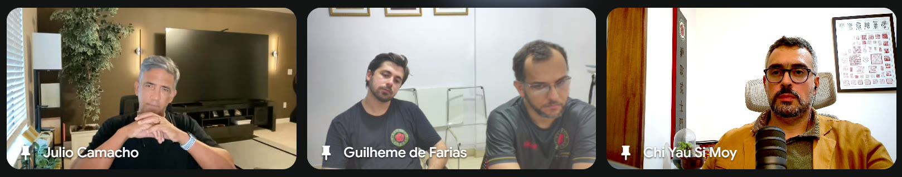

Si Fu perguntou a Homero, que praticou Hung Gar, se as sequências de lá precisam ser apresentadas numa ordem ou se algumas podem se intercambiar, principalmente com armas. Homero praticou Hung Gar e Choy Lei Fat, ambos de Foshan. Têm muitas sequências: as básicas, que grosso modo equivaleriam à trilogia do Ving Tsun, e depois especializações que cada um escolhe, porque é muito vasto. Comparou com a medicina: a graduação de clínico geral e depois a especialização numa parte do sistema.

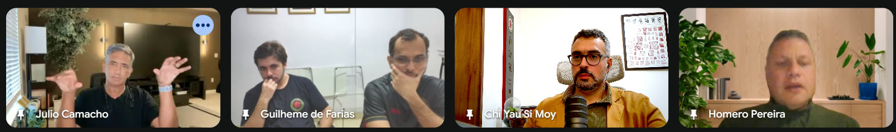

Um toque sobre a língua: a rigor, aquelas sequências se chamariam Faat, e não Kuen, porque Kuen tem a ver exatamente com punho. O Kuen está dentro do Faat, que quer dizer técnica. Em português, sequências de técnica, o que implica tanto mão livre quanto arma. Homero lembrou de já ter visto Kuen associado ao retorno da mão para a posição ao longo da sequência, e Si Fu ficou de mandar depois.

Daí um parêntese de Si Fu sobre os boatos de que as armas foram colocadas depois no Ving Tsun: ele era chamado Ving Tsun Kuen, um sistema de mãos. Comparou com o karatê, que lê como mão vazia, mencionando de passagem uma leitura possível de *kara* como China: pôr tonfa num karatê de mão vazia cria uma estranhezazinha na língua.

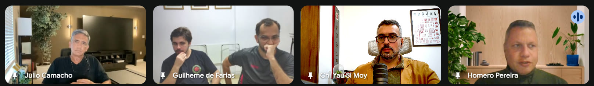

O exemplo que Si Fu queria era esse. No Choy Lei Fat, para ser mestre, conhecer todos os componentes, tem-se acesso aos componentes um, dois e três, mas não necessariamente a ordem importa. A ordem pode até importar, e ainda assim é um bom exemplo de algo que não se configura como Hai Tong. Si Fu confessou que lhe faltava o nome para esse tipo de sistema e que ia pesquisar. Desses estilos se fala em Paai, Kuen Paai, Mun Paai; e o Gar de Hung Gar é Ga 家, família.

### Gu Lao, um não sistema

Homero lembrou do Gu Lao Ving Tsun, de Leung Jan 梁贊, que, do pouco que conheceu, parecia uma tentativa de mexer justamente nessa ordem, o que geraria outro sistema. Si Fu esteve na vila de Gu Lao 古勞 e na casa em que Leung Jan nasceu e morreu, filmou demonstrações na época, material que espera ainda estar no seu Google Fotos. Ver também [Different lineages within Ving Tsun](/notes/different-lineages-within-wing-chun/).

Gu Lao é uma vila no meio do nada da China. Quando o ônibus chegou, a criançada veio correndo atrás, como quando chega artista numa cidade do interior. A casa, até para casa chinesa, era consideravelmente grande, de tijolos de cimento enormes, toda aberta, sem cômodos, só o telhado e as paredes. Si Fu, com a ressalva de que a memória pode trair, calculou umas sete ou oito vezes o escritório de onde falava, que já é grande, e cheia de gente com espaço sobrando. Família rica, no meio do mato. Havia um Muk Yan Jong lá, suspenso, vendido como se fosse dele, e depois souberam que não era.

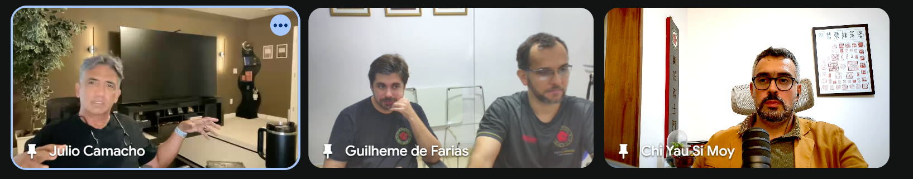

Si Fu conversou naquele dia com o Si Suk Leonardo Mordente e com algumas pessoas, e a sensação era de que a transmissão tinha sido exatamente não sistêmica. Ressalvou que faz muito tempo e que a tradução passava por várias mãos, do chinês para uma pessoa, dela para outra, e só então para o inglês, que ele ainda punha em português na cabeça. Pode estar cheio de ruído.

O que lhe passou foi que Leung Jan voltou para lá muito velho, entre aspas para morrer: já tinha feito o que tinha de fazer fora, estava se aposentando e queria passar os últimos anos na terra natal. Era uma figura notória, as pessoas o procuravam para aprender Kung Fu, e ele não se negava. Por isso Gu Lao Ving Tsun, para Si Fu, é o Ving Tsun daquele lugar, baseado muito em San Sao 散手, técnicas soltas. Si Fu se pôs no lugar dele: com oitenta e poucos anos, cansado, sem paciência ou tempo para conduzir alguém do zero, diante de um moleque de dez, doze anos que também só quer uns toquinhos, faz assim, faz aquilo.

Homero chamou de drills e lembrou de já ter visto coisas assim. Si Fu, podendo estar muito enganado, descreveu um monte de Lap Sao, coisas de ponta de dedo, mais parecido e misturado com o Kung Fu de filme do que com a coisa limpinha a que se está acostumado no Ving Tsun. Seguramente não se configura como sistema, e de forma alguma como Hai Tong. Como estilo no sentido de Mun Paai faz todo sentido, e de Kuen Paai evidentemente. Nessa linha dá para fazer uma hierarquia entre Kuen Paai, Mun Paai e Hai Tong, mas não é uma escadinha em que um evoluiu para o outro ou é melhor que o outro.

### Sistema em português, sistema em chinês

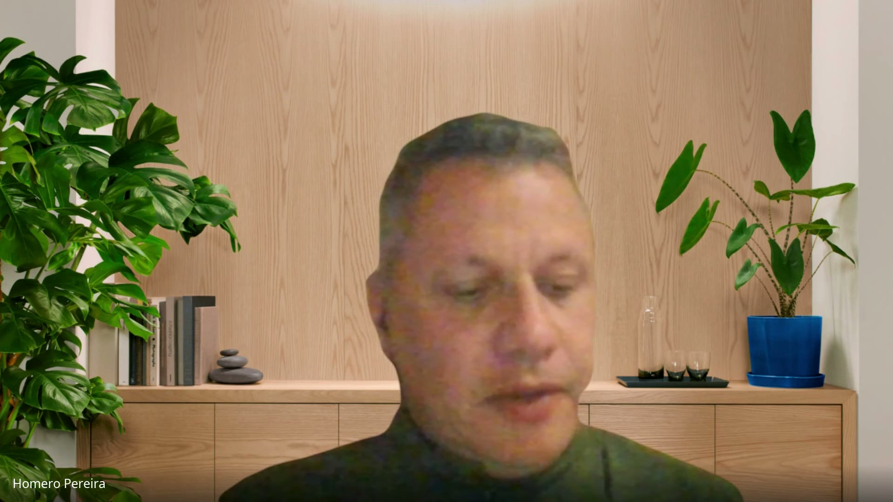

Homero quis atualizar uma noção que ouvia muito no Ving Tsun: sistema como conjunto de peças interdependentes, uma dependendo da outra para funcionar, todas voltadas para o mesmo resultado. Ela se aplica aos termos do dia?

Em português, sim; em chinês, depende. Si Fu gosta de traduzir sistema, em português, como uma estrutura temporal com entrada, processamento e saída. Se há processamento, a saída é necessariamente diferente da entrada: há um momento pré-sistema e um pós-sistema. Os elementos estão interligados, mas a língua chinesa tem várias maneiras de falar disso, uma que implica ser marcial, outra não, uma com a tradição envolvida, que é o caso do Mun Paai, outra sem.

O boxe, por exemplo, não tem um Mun Paai associado, mas há uma tradição na transmissão. É muito comum no boxe o que a família chama de vida Kung Fu: o moleque de rua, o treinador que aconselha a não usar droga, não roubar, não brigar, um envolvimento com a vida da pessoa para dar resultado no esporte.

O ponto mais importante é que, para se construir o que a família chama de sistema, a sequência é determinante. A definição de Homero não fala de ordem. Numa estrela de cinco pontas, os pontos estão interconectados, e mexendo para cá ou para lá o sistema não se desfaz: é fechado nele mesmo. Num sistema linear, dá para dobrar e envergar o Baat Jaam Do para cá, e continua linear, mas não se começa dali, e não há processo circular no Ving Tsun. Um Hai Tong nunca seria circular. Entra-se pelo Siu Nim Tau e sai-se pelo Baat Jaam Do, com um certo rigor.

Faltava a Si Fu, e ele não lembrava de ter estudado isso, um termo para a estrutura sistêmica em que as peças são todas conectadas sem ser necessariamente lineares, como o Choy Lei Fat, que tem um pedaço linear e outro que deixa de ser. Certamente há um nome, só não pesquisou. Si Fu insistiu na entrada, no processamento e na saída, com a saída diferente da entrada.

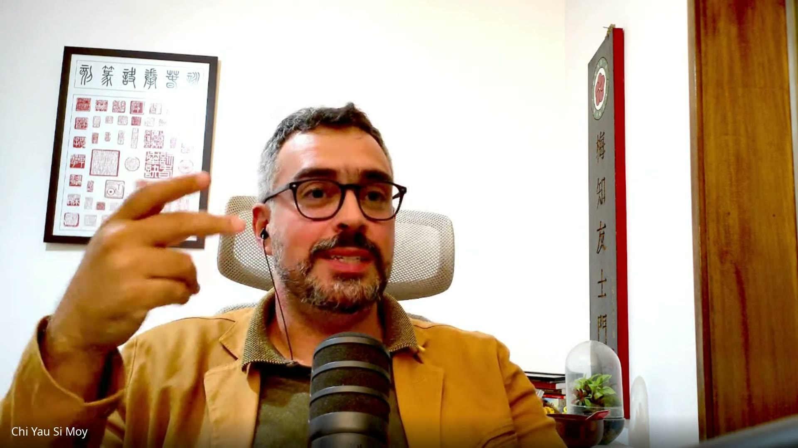

Thiago Silva retomou o Siu Nim Tau do [encontro anterior](/notes/xv-encontro-chines-instrumental/), a ideia de extrair o que é importante, o fundamento do que vai para a frente. E, até pela profissão de analista de sistemas, entende que sistemas não existem como coisa: são construções humanas, uma forma de categorizar para estudar. Era uma dúvida antiga dele com o sistema solar: o planeta não está nem aí para o que se acha dele, está lá girando, e quem o quebra em partes é quem o estuda. Quando há um objetivo, sistematiza-se, e daí vem a ideia de saída. O sistema pedagógico existe para desenvolver Kung Fu: entra-se, e sai-se com mais Kung Fu.

Si Fu não sabia como se diz sistema solar em chinês, mas sabia que não era nenhum dos três termos.

> [!NOTE] Pesquisa posterior
> Sistema solar é 太陽系 (太阳系), *tàiyángxì* ([MDBG](https://www.mdbg.net/chinese/dictionary?page=worddict&wdrst=1&wdqb=太陽系)): o mesmo 系 de [Hai](/notes/etimologia-de-hai-xi-7e6b/). Parece que o termo para sistemas onde a ordem não é relevante seria Hai 系 mesmo. Alguns outros termos relacionados, com as glosas do MDBG:
>
> 1. 體系 (*tǐxì*): "system / setup" ([MDBG](https://www.mdbg.net/chinese/dictionary?page=worddict&wdrst=1&wdqb=體系))
> 2. 體制 (*tǐzhì*): "system / organization" ([MDBG](https://www.mdbg.net/chinese/dictionary?page=worddict&wdrst=1&wdqb=體制))
> 3. 制度 (*zhìdù*): "system (e.g. political, adminstrative etc) / institution" ([MDBG](https://www.mdbg.net/chinese/dictionary?page=worddict&wdrst=1&wdqb=制度))
> 4. 機制 (*jīzhì*): "mechanism" ([MDBG](https://www.mdbg.net/chinese/dictionary?page=worddict&wdrst=1&wdqb=機制))

### Revisitar o sistema

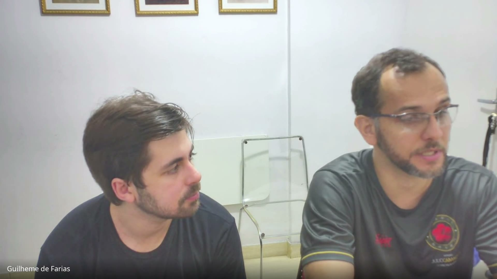

Guilherme lembrou de quando ouviu pela primeira vez a história do convite para jantar e passou a falar daquele jeito com Si Fu, desconfortável, esquecendo que os dois eram brasileiros. Estudar a cultura chinesa serve para se refinar como ser humano, mas a ideia não é se tornar chinês. Quer entender o conceito, falar sobre Ving Tsun, transmitir Ving Tsun, sem esquecer que é brasileiro, deixando a própria cultura permear aquilo. Sabe de onde vem, mas é brasileiro.

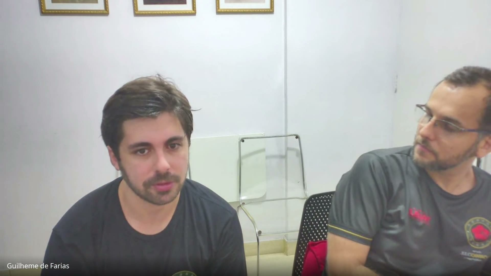

Daniel ouvia aquilo pela primeira vez. Para ele, sistema sempre foi ligado diretamente a Hai Tong, e Kuen Paai e Mun Paai despertaram curiosidade para escrever e ir atrás dos ideogramas, ver os radicais, pesquisar os significados, sem se prender a eles, como Si Fu tinha dito, porque o chinês é mais antigo que o sistema.

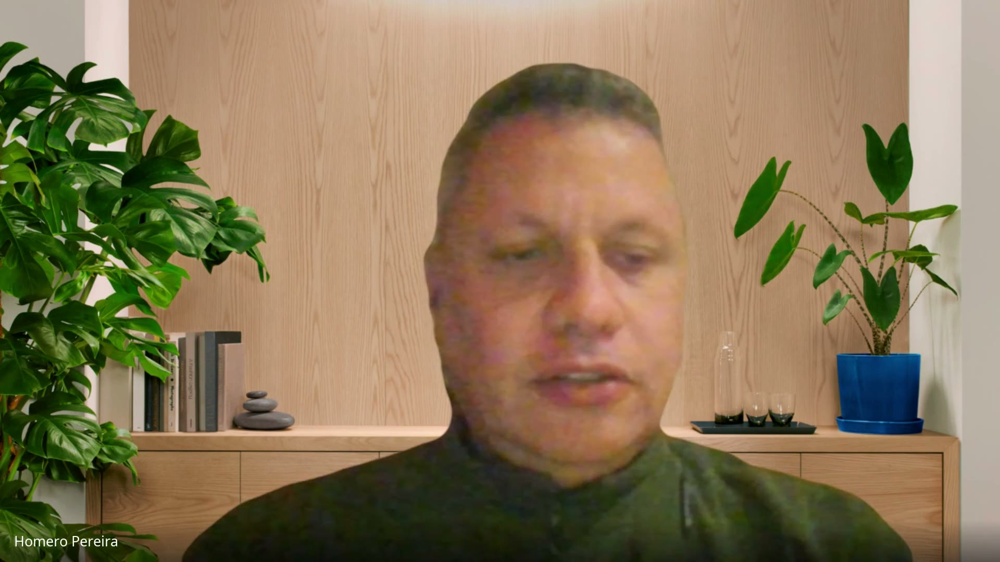

Homero gosta muito do assunto, porque é uma oportunidade de revisitar, ressignificar e reavaliar o conhecimento adquirido e aprender coisas novas. Lembrou do sistema de checagem: ao longo do processo, a pessoa amadurece até ter condições e ferramentas para avaliar a natureza do sistema ou da sequência que executa, em vez de seguir mecanicamente o que aprendeu. Propôs para outra oportunidade a relação entre as partes e o todo. Uma das partes são os nomes das formas e dos movimentos em chinês; outras são a natureza de cada movimento, a sequência e a conexão entre as sequências. Às vezes tem a sensação de que essa visão da parte para o todo e do todo para a parte não fica tão clara. Lembrou de uma apostila de cursos que tratavam desses componentes (TODO conferir: Fefisa?).

Si Fu lembrou que isso já foi feito com Thiago Silva, que tem o material por escrito: do Siu Nim Tau ao Baat Jaam Do, não no nível da técnica, mas das sequências e da relação com suas naturezas a partir do ideograma. Decuparam o oito, o corte, a faca, o seis, o meio, cada ideograma, para entender mais possibilidades além da interpretação usual, como gente de Kung Fu: o que a palavra está podendo dizer, não querendo. Só no [Cham](/notes/etimologia-de-cham-xun/) Kiu ficaram pelo menos duas aulas, nas possibilidades históricas de tradução e no que o ideograma Cham pode querer dizer, e o [Kiu](/notes/etimologia-de-kiu-qiao-55ac/) também. Muito provavelmente o grupo vai seguir por aí.

### Apêndice das etimologias

As etimologias dos ideogramas que apareceram no encontro, com o resumo de cada nota:

1. [拳 Kuen](/notes/etimologia-de-kuen-quan/) (*quán*, kyun4): composto de 手 (mão) com 龹 como fonético. O Shuowen glosa como "a mão", e Duan Yucai explica que a mão enrolada se torna 拳; o sentido marcial vem do gesto de fechar a mão sobre si mesma.
2. [派 Paai](/notes/etimologia-de-paai-pai-6d3e/) (*pài*, paai3): no Shuowen, 別水也, a água que se ramifica. Composto de 水 (água) e 𠂢; daí ramo, escola, facção, como em Ving Tsun Paai 詠春派.
3. [門 Mun](/notes/etimologia-de-mun-men-9580/) (*mén*, mun4): pictograma do portão de duas folhas, dois 戶 combinados. Por extensão, escola e linhagem, como em mun yan 門人, tung mun 同門 e si mun 師門.
4. [葉 Ip](/notes/etimologia-de-ip-ye-8449/) (*yè*, jip6): folha, composto de 艸 (planta) com 枼 como fonético. Como sobrenome, pronuncia-se Ip em cantonês, o de Ip Man 葉問.
5. [問 Man](/notes/etimologia-de-man-wen/) (*wèn*, man6): perguntar, 口 (boca) com 門 (porta) como fonético. É a boca debaixo da porta que Si Fu mostrou, e o Man de Man Sau 問手.
6. [繫/系 Hai](/notes/etimologia-de-hai-xi-7e6b/) (*xì*, hai6): atar, ligar, composto de 糸 (fio) com 毄 como fonético; 系 passou a substituir 繫 em usos tardios.
7. [統 Tong](/notes/etimologia-de-tong-tong-7d71/) (*tǒng*, tung2): originalmente o fio-mestre puxado do casulo da seda, daí ramo principal, disciplina, linhagem e governar.
