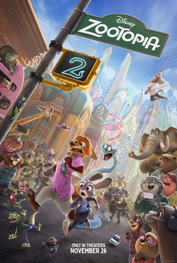

> Animação de comédia policial dirigida por Jared Bush e Byron Howard, escrita por Bush. Sequência de Zootopia (2016) da Walt Disney Animation Studios. Ginnifer Goodwin (Judy Hopps) e Jason Bateman (Nick Wilde) reprisam os papéis; Ke Huy Quan entra como Gary De'Snake. Os dois protagonistas viram parceiros na polícia de Zootopia e perseguem a jararaca Gary pela cidade depois de serem incriminados de um crime. Estreou em 13 de novembro de 2025; cinemas EUA em 26 de novembro. 108 minutos.

Filme fraco. O primeiro já não era tão bom.

