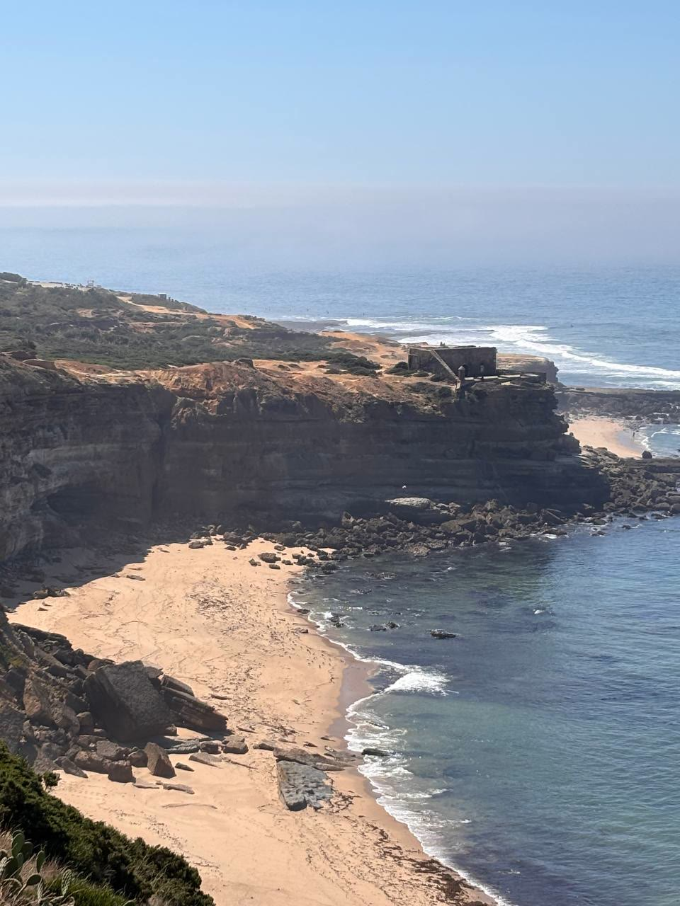
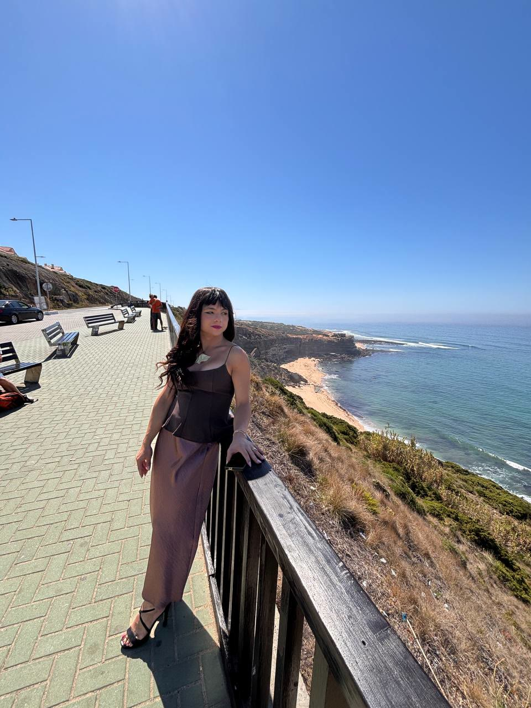

---
# GENERATED by scholion-places from place.json — do not edit.
# Any change made here is lost on the next render. Edit place.json instead,
# or use the API; the prose of the place lives in its "body" field.

title: "Mirante D'Ilha"
date: "2026-09-14T14:15:20+01:00"
lastmod: "2026-09-14T14:15:39+01:00"
category: place
summary: "Miradouro Ribeira D'Ilhas, perto da Ericeira"
kinds: ["flores"]
coords: [38.9878, -9.4189]
thumb: "2026-09-14-foto.jpg"
---

## 2026-09-14 — Avistamento

Vista para a praia de falésias, mar azul. Passeio de calçada junto à costa.

