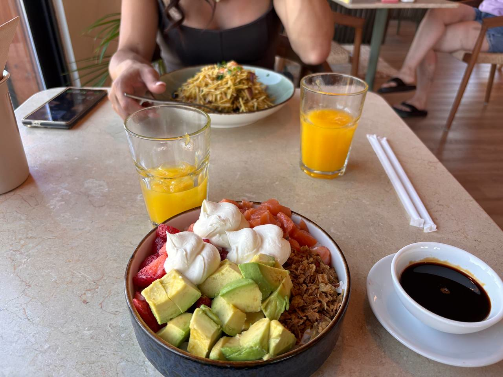

---
# GENERATED by scholion-places from place.json — do not edit.
# Any change made here is lost on the next render. Edit place.json instead,
# or use the API; the prose of the place lives in its "body" field.

title: "Restaurante Ribbai"
date: "2026-09-14T14:09:25+01:00"
lastmod: "2026-09-14T14:12:40+01:00"
category: place
kinds: ["restaurante"]
coords: [38.988103, -9.418044]
thumb: "2026-09-14-foto.jpg"
---

## 2026-09-14 — Visita

Nota: ★★★★★

Salmão, abacate, morangos e sumo de laranja. Porções boas para dividir — preço salgado, mas a batata de entrada vale muito a pena.

