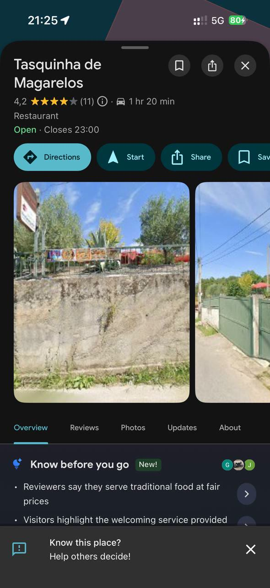

---
# GENERATED by scholion-places from place.json — do not edit.
# Any change made here is lost on the next render. Edit place.json instead,
# or use the API; the prose of the place lives in its "body" field.

title: "Tasquinha de Magarelos"
date: "2026-09-11T21:25:50+01:00"
lastmod: "2026-09-11T21:57:07+01:00"
category: place
summary: "Restaurante com esplanada e vistas agradáveis"
kind: ["flores", "restaurante"]
species: ["hortensia"]
coords: [41.319328, -7.667712]
address: "Magarelos, Vila Real"
---

## 2026-08-31 — Visita

Nota: ★★★★★

Comida excelente com preço baixo

